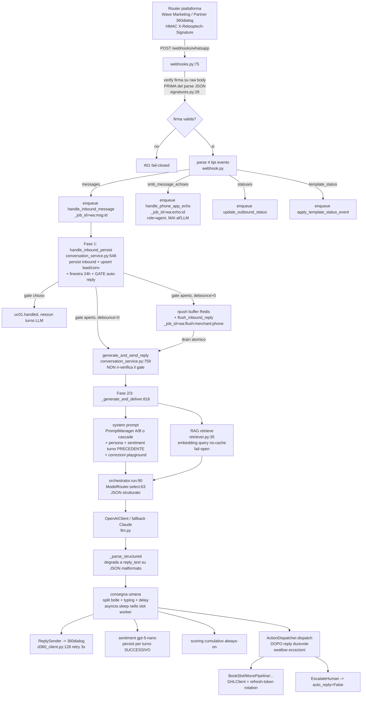

# Audit del flusso runtime dell'agente AI conversazionale — Reloop AI

**Data:** 2026-06-22
**Scope:** Audit del solo **flusso runtime dell'agente AI conversazionale** (ingresso webhook WhatsApp → orchestrazione LLM → consegna risposta → side-effect GHL/scoring/obiezioni → flussi proattivi e pipeline di fine-tuning). **Non** copre l'intera piattaforma (admin/merchant UI, billing, auth/RLS lato API, deploy). Tutte le citazioni `file:riga` provengono dalla lettura statica del codice; nessun test runtime è stato eseguito.

---

## TL;DR

- **Il flusso end-to-end è solido nel disegno** (verifica firma router prima del parse, dedup a due livelli, persistenza inbound sempre durevole, consegna best-effort delle azioni dopo che la reply è già partita), ma un audit in due passaggi ha portato a **sei criticità gravi (HIGH)** distribuite su sicurezza/multitenancy, correttezza delle azioni, affidabilità e privacy/compliance — non una singola classe.
- **[HIGH — Compliance/Concorrenza] TOCTOU sul gate takeover/opt-out/soft-pause**: il gate auto-reply è valutato solo in Fase 1 (`conversation_service.py:631-643`) e **mai ri-verificato al flush/inline** (`conversation_service.py:759-816`). Il bot può rispondere automaticamente **dopo** che un operatore ha preso il controllo, **dopo** uno STOP del cliente (invio post-opt-out = violazione compliance), o durante una soft-pause Coexistence.
- **[HIGH — Privacy/FT] L'estrazione Obiezioni invia il transcript grezzo a OpenAI senza anonimizzazione** (`scheduler/objections.py:30-106`). A differenza della pipeline FT (doppio strato regex+presidio), questo percorso LLM automatico esfiltra PII verbatim (e il prompt chiede esplicitamente citazioni testuali) fuori dal boundary contrattuale Art. 5.2.
- **[HIGH — Privacy/FT] Nessun gate di consenso/opt-out prima della raccolta log per il fine-tuning** (`fine_tuning/collect.py:47-60`): un lead che ha fatto STOP mantiene `status` booked/qualified e finisce nel dataset inviato a OpenAI. (Lo scenario erasure/DSAR è invece coperto dall'hard-delete a cascata.)
- **[HIGH — Sicurezza/Multitenancy] Nessun invariante DB di unicità su `phone_number_id`**: `integrations` ha UNIQUE solo su `(merchant_id, provider)` e l'endpoint interno `/internal/whatsapp-connected` lega un numero a un `merchant_id` arbitrario (`internal.py:104-121`). Una collisione di binding rompe `resolve_whatsapp().one_or_none()` (DoS dell'inbound del merchant legittimo, eccezione non catturata) e la tenancy del worker resta decisa da un campo del payload non legato alla firma del router.
- **[HIGH — Correttezza] "Conferma falsa"**: la `reply_text` dell'LLM ("ti ho prenotato") parte **prima** del dispatch delle azioni, che gira best-effort e **ingoia** l'errore GHL (`conversation_service.py:1011-1029,1067` + `:92-106`). Su fallimento GHL il cliente riceve una conferma falsa; per `move_pipeline` non c'è neppure un messaggio correttivo, e l'azione è persa senza retry né dead-letter.
- **[HIGH — Affidabilità] Timeout/429 OpenAI con fallback Claude OFF**: l'eccezione risale non catturata e il job ARQ viene **ritentato fino a 5 volte rigenerando una risposta diversa** ogni volta (`temperature 0.3`); se il 429 persiste il turno è scartato **senza dead-letter né escalation** (`orchestrator.py:90-100`, default ARQ in `settings.py`).
- **[MEDIUM] Idempotenza inbound non atomica**: `wa_message_id` ha solo un **indice non univoco** (`models/conversation.py:99`), idempotenza affidata a check-then-insert applicativo → su redelivery concorrente, **doppia persistenza + doppia risposta** (mitigato da dedup ARQ e debounce quando attivo).
- **[MEDIUM] Default operativi pericolosi e silenziosi**: `BOT_AUTO_REPLY_ENABLED` default **False** (bot muto finché non abilitato), **consegna "umana" tutta OFF** di default (`schema.py:203-211`), `anthropic_fallback_enabled` False, `router_shared_secret` vuoto e solo "recommended" (se mancante → ogni inbound rigettato 401).
- **[MEDIUM] Costo/latenza non controllati**: chiamata **sentiment (gpt-5-nano) incondizionata e in serie a ogni turno**, **embedding RAG senza cache** a ogni turno, e (privacy a parte) il **gate eval FT usa il training set come held-out** (`evaluate.py:114-126`) con un proxy di qualità che misura solo "JSON valido".
- **Mitigante trasversale chiave:** molte race richiedono il **debounce attivo** (default OFF), ma il default-OFF a sua volta apre il percorso inline non serializzato (nessun lock per-peer) come **caso ordinario**, non eccezionale.

---

## Architettura del flusso, end-to-end

Il percorso di un messaggio attraversa sette sottosistemi: ingresso webhook → handler worker (debounce/lock/takeover) → `ConversationService` (pipeline del turno) → Orchestrator/Router/LLM → azioni dell'agente → RAG/Knowledge Base → segnali (scoring/sentiment/Obiezioni/consegna umana). L'invio outbound è **disaccoppiato** dal router di piattaforma e parla direttamente a 360dialog.



### 1. Ingresso inbound (webhook WhatsApp → enqueue)

Tutti gli eventi WhatsApp arrivano dal **router di piattaforma "Wave Marketing"** (Partner 360dialog), non direttamente da 360dialog/Meta, su un unico endpoint `POST /webhooks/whatsapp` (`routers/webhooks.py:75`). Il router firma il **body grezzo** con HMAC-SHA256 (chiave `router_shared_secret`) sull'header `X-Relooptech-Signature`; il backend verifica la firma sui byte grezzi **prima** di parsare il JSON (`webhooks.py:89` → `router/signatures.py:28`, confronto constant-time con `hmac.compare_digest`). Fail-closed: header o secret mancante → 401 (`webhooks.py:94-99`).

Dallo stesso envelope (byte-identico a Meta Cloud API) quattro parser distinti in `whatsapp/webhook.py` estraggono: **inbound** (`parse_inbound_payload:138`), **echo Coexistence** (`parse_message_echo_payload:176`, gated rigorosamente su `field=='smb_message_echoes'`), **status outbound** (`parse_status_payload:77`) e **status template** (`parse_template_status_payload:103`). Ogni evento è accodato su ARQ con un `_job_id` deterministico (`wa:msg:` / `wa:echo:` / `wa:status:` / `wa:tplstatus:`), secondo strato di dedup oltre alla dedupe 24h del router. I media non testuali non vengono droppati: si sintetizza un placeholder (`_MEDIA_PLACEHOLDER`), mentre video/document vanno in handoff umano (`_HANDOFF_MEDIA`). L'**outbound non passa dal router** (`factory.py:38` → `d360_client.py:128`, retry tenacity 3x).

### 2. Worker handler conversazione (debounce, lock, takeover)

Il job `handle_inbound_message` (`workers/conversation/handlers.py:72`) recupera la runtime condivisa (`ctx['runtime']`, costruita una volta in `workers/runtime.py:95` con router+orchestrator+dispatcher+sender+sentiment) e procede in due fasi. **Fase 1** (`service.handle_inbound_persist`) persiste sempre l'inbound, fa upsert lead+conversazione, apre la finestra 24h e calcola il **gate auto-reply** (master `BOT_AUTO_REPLY_ENABLED` AND `conv.auto_reply` AND non opted-out AND non soft-paused, `conversation_service.py:631-643`). Se il gate è chiuso il job termina senza turno LLM.

Se il gate è aperto e `debounce_window_s>0`, i frammenti ravvicinati dello stesso peer sono accumulati in un buffer Redis con un "due epoch" e un job di flush a `_job_id` stabile (`wa:flush:{merchant}:{phone}`, `handlers.py:118-150`) che si auto-rischedula finché il peer tace; al flush (`handlers.py:175`) il buffer è drenato atomicamente (lrange+delete in pipeline) e si genera **una sola** risposta. Senza debounce (default) → risposta immediata inline (`handlers.py:154`). Il **takeover umano** è realizzato flippando `conversation.auto_reply=False` (`actions/escalate.py:41`), così che gli inbound successivi superino il gate Fase 1 senza risposta automatica.

### 3. ConversationService — pipeline reale del turno

`handle_inbound_persist` (`conversation_service.py:548`) risolve l'integrazione da `phone_number_id`, apre `tenant_session` come `role='worker'`, fa l'idempotenza su `wa_message_id` (check-then-insert, `:586`, `:668`), assegna la variante A/B alla creazione conversazione (`_assign_ab_variant:1361`), gestisce **opt-out UC-06** (`_is_opt_out:1357`, match esatto normalizzato) e calcola il gate. `_generate_and_deliver` (`:818`) riapre la propria sessione, risolve il system prompt via `PromptManager` (variante A/B authored vince e **bypassa** persona/sentiment/correzioni; altrimenti `build_cascade_system_prompt:259`), esegue RAG best-effort, gestisce off-hours (`_maybe_off_hours_message:1251`, risposta sintetica senza LLM), chiama l'orchestrator, applica la policy di handoff, persiste reply, e consegna in modo "umano". Le azioni sono dispatchate **dopo** che reply e turno sono durevoli (`ActionDispatcher.dispatch:92`, swallow eccezioni).

Nota importante di disegno: **il worker usa sempre `generate_and_send_reply`** (anche senza debounce), che **ricarica tutto fresco** dal contesto — quindi il `_ReplyContext` catturato in Fase 1 in produzione non viene mai usato dal worker. Questo è la radice del finding TOCTOU (sotto): il re-load fresco **non** rilegge il gate.

### 4. Orchestrator + ModelRouter + LLMClient + FT routing

`ConversationOrchestrator.run` (`orchestrator.py:90`) costruisce i messaggi (system prompt + hint schema JSON + qualificazione lead + KB + history + user message), stima i token (`len//4`, `:76`) e compone una `RoutingRequest`. `ModelRouter.select` (`router.py:63`) applica la cascata: `force_model` (solo playground) → modello sentiment → **escalation a gpt-5.2** se scatta un trigger OR (`_escalation_triggers:100`: context>4000 tok, lead caldo, keyword critiche, turn_count≥15, purpose=='escalation') → override **FT per-tenant** (`FtModelResolver`, `ft_routing.py:43`) → default gpt-5-mini.

`_parse_structured` (`orchestrator.py:203`) valida l'output contro uno schema Pydantic; su JSON malformato **degrada a `reply_text=raw`, actions=[]** senza retry né metrica. Su eccezione del primario si tenta il fallback Claude **senza `response_format`** (gated da feature flag, default OFF). Da notare: il `FtModelResolver` **è effettivamente cablato** in produzione (`api/main.py:78`, `workers/runtime.py:98`) — il CLAUDE.md che lo dichiara "not yet wired" è stale.

### 5. Azioni dell'agente (booking, pipeline, scoring, escalate, appuntamenti)

L'orchestrator emette una lista di `OrchestratorAction`; `ConversationService` forza sempre **esattamente una** `update_score` (`_with_score_action:1324`) fondendo segnali behavioural+content, poi `ActionDispatcher` instrada ai 7 handler registrati in `workers/runtime.py:106-155` (BookSlot, ProposeSlots, MovePipeline, UpdateScore, EscalateHuman, RescheduleSlot, CancelSlot). Tutti tranne `update_score` parlano con GHL; gli handler sono **best-effort** (girano dopo che la reply è partita, ognuno con la propria sessione, eccezioni catturate e mai propagate). GHL è source-of-truth per appuntamenti/opportunity; localmente si tengono mirror (`appointments`) e si stampano gli id GHL su `leads.meta`. La **rotazione del refresh-token GHL** è committata in transazione separata (`booking.py:130-146`) per sopravvivere a un rollback dell'handler — mitigazione corretta del gotcha noto.

### 6. RAG / Knowledge Base

L'`Indexer` (`rag/indexer.py:41`) è idempotente (delete-then-insert), chunk ~1600 char con overlap 200 (`chunker.py:20`), embedding `text-embedding-3-small` 1536 dim batch. A runtime `RAGEngine.retrieve` (`retriever.py:35`) embedda la query, esegue la SELECT pgvector (`<=>` cosine, indice HNSW) con `LIMIT top_k` e **filtra `min_score` in Python dopo il LIMIT** (`:69`) — il numero finale può essere < top_k (anche 0). Il retrieval in conversazione è **fail-open**: qualsiasi errore (incl. quota/timeout embeddings) → `kb_chunks=[]` e warning (`conversation_service.py:857-858`), il bot risponde de-groundato senza segnalarlo. La RLS sui chunk è merchant-scoped via JOIN su `merchants.tenant_id`.

### 7. Segnali (scoring, sentiment, Obiezioni, consegna umana, correzioni)

Per ogni turno: **sentiment** (gpt-5-nano, `sentiment.py:33`) calcolato dopo la reply e persistito per il turno **successivo**; **scoring cumulativo always-on** (UC-05) con content signals sticky OR-merged e behavioural ricalcolati (`scoring.py`); **consegna umana** ADR 0008 (`delivery.py`, split bolle + typing + delay, **OFF di default**). Le **Obiezioni** (UC-13) sono estratte solo a fine conversazione: il cron `close_idle_conversations` chiude le conversazioni idle >120min e accoda `objection_extraction` (`scheduler/objections.py:30`), terza chiamata LLM (gpt-5-mini) sull'intero transcript.

---

## Flussi proattivi (scheduler/automazioni)

Due meccanismi convergono sullo stesso gate di compliance `decide_outbound` (`workers/outbound.py:49`, enforcement finestra 24h: text/template/skip, mai free-text fuori finestra senza template approvato).

- **UC-03 follow-up no-answer** (cron ogni 15m, `no_answer.py:48`): scan cross-tenant di conversazioni `active` con `last_message_at < now-30m`, soglie per-merchant, `resolve_lifecycle_step(FLOW_NO_ANSWER)`, dedup Redis `noanswer:{conv}:{attempt}`. **Lo scan NON filtra opt-out/auto_reply/handoff** (`conversation.py:122`) — a differenza di UC-06.
- **UC-06 riattivazione dormienti** (cron giornaliero 09:00 UTC, `reactivation.py:45`): scan con floor conservativi che **filtra** `opted_out_at IS NULL`, `status != 'erased'`, `auto_reply IS TRUE` (`lead.py:227-238`); within_window sempre False → richiede template approvato.
- **UC-13 chiusura idle + Obiezioni** (cron orario, `close_conversations.py:35`): marca `closed` le conversazioni idle e fa fan-out di `objection_extraction`. La soglia idle è letta **solo da SYSTEM_DEFAULTS**, ignorando l'override merchant (`close_conversations.py:27-32`).
- **Lavagnetta event-driven** (cron ogni minuto, `automation/engine.py:107`): tail di `analytics_events` con cursore Redis, fan-out di `automation_run` (walk del grafo condition/action/wait). `EVENT_TO_TRIGGER` mappa anche `reminder.sent`→`no_answer`, così i send legacy possono innescare automazioni utente.
- **Fine-tuning** (solo on-demand, nessun cron, `routers/fine_tuning.py:28`): collect → quality → anonimizzazione regex+presidio + export JSONL → submit OpenAI FT con **polling sincrono** → evaluate held-out con gate → deploy A/B o default tenant. Presidio è **realmente cablato** (`export.py:53`), obbligatorio in produzione.

---

## Analisi delle criticità

Ordinate per gravità all'interno di ogni dimensione. Tutte verificate avversarialmente (verdict `confirmed`/`partial`).

### Sicurezza / Multitenancy & Compliance

#### [HIGH · confirmed] TOCTOU sul gate takeover/opt-out/soft-pause
| | |
|---|---|
| **Posizione** | `conversation_service.py:631-643,759-816` · `workers/conversation/handlers.py:118-150,175-233` |
| **Descrizione** | Il gate auto-reply (master AND `conv.auto_reply` AND NOT opted_out AND NOT soft_paused) è calcolato solo in Fase 1; `auto_reply_on` viaggia nel `PersistOutcome`. Con debounce attivo l'invio avviene al flush molto dopo, e `generate_and_send_reply` **non rilegge** `conv.auto_reply`, `ai_disabled_until`, né `lead.opted_out_at` prima di consegnare. `get_active` restituisce la conversazione anche dopo `mark_escalated` (status resta `active`). |
| **Impatto** | Il bot risponde **dopo** un takeover operatore (collisione), **dopo** uno STOP bufferizzato (**invio post-opt-out = violazione compliance UC-06**), o durante soft-pause Coexistence. Sono esattamente gli stati che il sistema dichiara di rispettare. |
| **Raccomandazione** | Ri-valutare l'intero gate dentro `generate_and_send_reply`/`_generate_and_deliver` subito dopo il re-load, nella stessa transazione che invia, idealmente con `SELECT ... FOR UPDATE` sulla riga conversation per serializzare contro `mark_escalated`. Abortire (`no_reply`) se uno qualunque dei flag è cambiato. |
| **Attenuante** | Debounce OFF di default → percorso inline con finestra TOCTOU trascurabile; con debounce attivo finestra ≤30s (estendibile dal self-reschedule). Resta high per il rischio compliance/STOP. |

#### [HIGH · confirmed] Nessun invariante DB di unicità su `phone_number_id` → DoS / dirottamento della risoluzione tenant
| | |
|---|---|
| **Posizione** | `libs/db/.../models/integration.py:20` · `repositories/integration.py:69-92` · `routers/internal.py:104-121` |
| **Descrizione** | La tabella `integrations` ha l'unico UNIQUE su `(merchant_id, provider)`; **nessun indice/vincolo univoco** su `meta->>'phone_number_id'` né su `external_account_id` (verificato su tutte le migrazioni 0001-0028). `resolve_whatsapp` chiude con `.one_or_none()`: se due merchant attivi condividono lo stesso `phone_number_id`, la query solleva `MultipleResultsFound`. L'endpoint interno `/internal/whatsapp-connected` (firmato HMAC dal router) fa `upsert_whatsapp(merchant_id=UUID(customer_id), ...)` per ogni `customer_id` indicato dal router, **senza** verificare che il numero non sia già legato a un altro merchant né che il `customer_id` appartenga a un tenant coerente col `platform_id`. |
| **Impatto** | (a) **DoS mirato**: legare lo stesso `phone_number_id` a un secondo merchant rompe in modo silenzioso la risoluzione inbound del merchant legittimo (eccezione non catturata in `conversation_service.py:1191`, propagata anche in outbound e nei cron); (b) **dirottamento di tenancy**: se la collisione viene risolta lasciando attiva una sola riga "sbagliata", gli inbound finiscono nel merchant errato. L'isolamento per-merchant dell'inbound poggia su un invariante non garantito dallo schema. |
| **Raccomandazione** | Indice UNIQUE parziale (`status='active'`) su `external_account_id`/`meta->>'phone_number_id'` per provider whatsapp; in `upsert_whatsapp` rifiutare/loggare un bind se il numero è già di un altro merchant; in `whatsapp_connected` validare che il `merchant_id` appartenga a un tenant servito dal `platform_id`. |
| **Attenuante** | L'endpoint è autenticato HMAC sul raw body col `router_shared_secret`: **non** sfruttabile da esterno non autenticato (fiducia riposta nel router). Il vettore DoS-su-collisione è però deterministico e privo di qualsiasi backstop a DB. |

#### [MEDIUM · confirmed] Soft-pause Coexistence vs reply concorrente
| | |
|---|---|
| **Posizione** | `conversation_service.py:636-643` · `workers/conversation/handlers.py:249-282` |
| **Descrizione** | Un echo phone-app imposta `ai_disabled_until=now+2h` in un job/slot separato; la soft-pause è letta **solo** in Fase 1. Se l'echo arriva nella finestra debounce, il flush invia comunque. È lo stesso difetto read-once del TOCTOU sopra, ristretto al canale Coexistence. |
| **Impatto** | Bot e merchant rispondono allo stesso cliente in pochi secondi — proprio ciò che la soft-pause dovrebbe prevenire. |
| **Raccomandazione** | Parte del fix TOCTOU (rileggere `ai_disabled_until` prima dell'invio). In più, azzerare il buffer debounce del peer all'arrivo di un echo phone-app per quel `customer_phone`. |

#### [MEDIUM · partial] Tenancy del worker decisa da `phone_number_id` non autenticato nel body del webhook
| | |
|---|---|
| **Posizione** | `routers/webhooks.py:78-135` · `conversation_service.py:567-579,1181-1191` · `repositories/integration.py:69-92` |
| **Descrizione** | La firma HMAC del webhook prova **solo** che il chiamante è il router "Wave Marketing", non lega quel `phone_number_id` al WABA reale del mittente. Il `phone_number_id` arriva da `metadata.phone_number_id` del payload e viene instradato tale e quale fino a `resolve_whatsapp`, che matcha qualsiasi riga `whatsapp/active` con quel numero; `tenant_id`/`merchant_id` del `TenantContext(role='worker')` derivano interamente da quella riga. Le RLS **non** proteggono qui: i claim sono già quelli (eventualmente sbagliati) del merchant risolto. |
| **Impatto** | Se il router emette un evento firmato con un `phone_number_id` di un altro merchant (bug, channel mis-mappato, compromissione parziale a monte), l'intero turno — persistenza messaggi/lead, lettura history, azioni GHL — gira nel tenant errato senza che alcuna RLS lo blocchi. |
| **Raccomandazione** | Far includere al router, nella busta firmata, l'identità channel/merchant già validata e confrontarla con la riga risolta; o derivare il merchant dal `channel_id`/destinatario gestito dal router invece che dal `metadata.phone_number_id` echo-ato; allertare quando un evento risolve un numero mai onboardato per quel `platform_id`. |
| **Nota** | Gravità ridotta a medium: non raggiungibile da una parte esterna non fidata (gated dalla firma del router); è un irrobustimento del confine di fiducia col router. Stessa radice della criticità sull'unicità `phone_number_id` sopra. |

#### [LOW · partial] Webhook GHL marketplace: tenancy da `locationId`/`companyId` firmati con la chiave **pubblica globale**
| | |
|---|---|
| **Posizione** | `routers/webhooks.py:210-289` · `workers/conversation/handlers.py:351-433,500-566` · `ghl/marketplace_signatures.py:13-15,108-136` · `repositories/ghl_marketplace.py:283-290` |
| **Descrizione** | Gli eventi marketplace (INSTALL/UNINSTALL e data webhook ContactUpdate/Opportunity/call-outcome) sono verificati con la chiave Ed25519/RSA che il codice stesso documenta come "global published constants (same for every Marketplace app)". La firma prova "questo body viene da GHL", non "da questo tenant". Il routing avviene poi su `companyId`/`locationId` del payload; `merchant_id_for_location` ritorna il merchant senza filtrare lo `status` della location; tutto gira su `session_scope()` service-role (RLS bypassata di proposito). |
| **Impatto** | Chi possiede la chiave privata globale GHL (o riesce a far inoltrare a questa URL un evento firmato con un `companyId`/`locationId` scelto) può pilotare scritture cross-tenant su contatti/pipeline/lead. |
| **Raccomandazione** | Dopo la verifica firma, validare che `companyId`/`locationId` corrisponda a un install attivo per il tenant atteso; rendere `merchant_id_for_location` sensibile allo `status`; valutare un secondo fattore di binding (token segreto per-location nella Default Webhook URL o allowlist di companyId). |
| **Nota** | Gravità low: l'unica premessa d'attacco realmente sfruttabile (possesso della chiave privata globale GHL) è fuori dal confine di fiducia di Reloop e colpirebbe identicamente ogni app del marketplace GHL. |

#### [LOW · partial] Gli handler delle azioni si fidano dei campi prodotti dall'LLM (prompt injection intra-merchant)
| | |
|---|---|
| **Posizione** | `orchestrator.py:39-41,292-297` · `actions/pipeline.py:87-143,244-279` · `actions/booking.py:104-159` |
| **Descrizione** | `OrchestratorAction.payload` è `dict[str, Any]` libero, validato solo per forma. Gli handler consumano direttamente `stage_id`/`pipeline_id`/`opportunity_id`/`value`/`currency` (pipeline) e `calendar_id`/`duration_min`/`preferred_start_iso` (booking) dal payload. Poiché il messaggio utente confluisce nel prompt, un utente può tentare via prompt injection di far emettere all'LLM un payload arbitrario. |
| **Impatto** | Manipolazione **intra-merchant** guidata dall'utente: spostamento del lead in stage/pipeline non previsti, opportunità con valore monetario arbitrario, prenotazione su calendario non configurato. **Nessun attraversamento cross-tenant**: il contatto è `turn_ctx.lead_phone` server-side e tutte le chiamate usano il token della location del merchant risolto. |
| **Raccomandazione** | Validare i campi GHL del payload contro i valori ammessi per il merchant (usarli solo come hint con fallback alla config cascade); azzerare/limitare `value`/`currency` dall'LLM; introdurre un modello Pydantic per-azione tipizzato invece di `dict[str, Any]`. |

#### [LOW · confirmed] `actor_id` del worker = `merchant_id`; eventi GHL service-role senza attore strutturato → audit indistinguibile
| | |
|---|---|
| **Posizione** | `conversation_service.py:574-579,780-785,825-830` · `actions/booking.py:85-90` · `handlers.py:362-363,425-432,490-496` |
| **Descrizione** | In tutti i percorsi worker il `TenantContext` usa `role='worker'` e `actor_id=merchant_id` (che finisce in `claims.sub`), cioè l'attore è il merchant stesso, non un'identità di servizio. I path service-role degli eventi GHL aprono `session_scope()` (RLS-bypass) e loggano solo `actor='system:ghl_webhook'` come stringa libera non persistita. |
| **Impatto** | L'invariante "ogni chiamata service-role loggata con `actor_id`" è soddisfatto solo nominalmente: in un incidente non si distingue chi/cosa ha generato una scrittura (worker vs evento GHL vs umano). Non è un bypass di isolamento, ma indebolisce l'audit. |
| **Raccomandazione** | `actor_id` di servizio dedicato e riconoscibile (UUID riservato "worker"/"ghl_webhook") nel `TenantContext` e/o campo attore strutturato e persistito sugli analytics events dei path service-role, mantenendo `merchant_id` separato dal soggetto che ha agito. |

### Concorrenza & Affidabilità

#### [HIGH · confirmed] Timeout/429 OpenAI con fallback Claude OFF → 5 retry ARQ che rigenerano una risposta diversa
| | |
|---|---|
| **Posizione** | `orchestrator.py:90-100` · `workers/settings.py:76-120` (nessun `max_tries`) · `conversation_service.py:759-816` |
| **Descrizione** | Se `client.complete()` solleva (timeout 30s o 429), `ModelRouter.fallback()` ritorna `None` con `anthropic_fallback_enabled=False` (default) e l'eccezione è **ri-sollevata** (`orchestrator.py:99`), risalendo non catturata fino all'handler ARQ. `WorkerSettings` non imposta `max_tries`, quindi vale il default ARQ (`max_tries=5`, `retry_jobs=True`). A ogni ritentativo `generate_and_send_reply` **ricarica la history** (escludendo solo l'inbound utente) e **ri-genera** l'output con `temperature 0.3` → risposta potenzialmente diversa ogni volta. |
| **Impatto** | Su 429/timeout transitorio il cliente attende minuti (backoff ARQ) e si consuma budget OpenAI multiplo per lo stesso turno. Se il 429 persiste, dopo 5 tentativi il turno è **scartato senza dead-letter né notifica**: l'inbound risulta "handled" in Fase 1 ma la risposta non arriva mai. |
| **Raccomandazione** | `max_tries` esplicito (es. 3 con backoff) per la coda inbound; trattare il fallimento LLM definitivo come **escalation a umano** (flip needs-human + notifica) invece di scartare; valutare il fallback Claude per la sola classe timeout/429 anche senza flag globale, o un breve retry interno sul 429 dentro l'orchestratore prima di propagare. |

#### [MEDIUM · partial] Idempotenza inbound non atomica → doppia persistenza + doppia risposta
| | |
|---|---|
| **Posizione** | `models/conversation.py:99` · `conversation_service.py:586-675` · `repositories/message.py:15-57` |
| **Descrizione** | `wa_message_id` ha solo un indice **non univoco** (`ix_messages_wa_message_id`, migration `0001_initial.py:485` senza `unique=True`; verificato fino a 0015). Idempotenza affidata a check-then-insert applicativo in due `tenant_session` indipendenti (READ COMMITTED): due esecuzioni concorrenti dello stesso `wa_message_id` vedono entrambe `already_persisted=None`, inseriscono entrambe e generano due turni LLM. |
| **Impatto** | Doppio messaggio user, **doppia risposta cliente-visibile**, doppio `update_score`/`message.received`, potenziale doppia azione `book_slot`/`move_pipeline` su GHL. |
| **Raccomandazione** | UNIQUE su `(merchant_id, wa_message_id) WHERE wa_message_id IS NOT NULL` + `INSERT ... ON CONFLICT DO NOTHING RETURNING`, trattando il conflitto come "già processato". In alternativa `pg_advisory_xact_lock(hashtext(wa_message_id))` all'ingresso Fase 1. |
| **Attenuante** | Dedup ARQ `_job_id=wa:msg:{id}` (keep_result ~1h) restringe la finestra; debounce attivo coalesce il doppio reply. Concreto soprattutto con debounce OFF (default). |

#### [MEDIUM · confirmed] `_job_id` ARQ non garantisce mutua esclusione runtime per-peer
| | |
|---|---|
| **Posizione** | `routers/webhooks.py:125-134` · `workers/conversation/handlers.py:118-150,175-211` · `workers/settings.py:76-120` |
| **Descrizione** | Il dedup `_job_id` è per-message, non per-peer. Due inbound con `message_id` diversi dello stesso peer girano in parallelo (default ARQ `max_jobs=10`, `max_tries=5`, nessun override). Nessun lock applicativo (advisory/Redis/`FOR UPDATE`) avvolge `generate_and_send_reply`. Il debounce — unico serializzatore via drain-and-delete — è **OFF di default**, quindi due inline paralleli per lo stesso peer sono il **percorso normale**. |
| **Impatto** | Sotto burst o retry ARQ, più generazioni coesistono per lo stesso peer, invii sovrapposti, ordinamento bolle non deterministico. |
| **Raccomandazione** | Lock per-`(merchant_id, conversation_id)` (Redis SET NX con TTL > durata multi-bubble, o advisory lock) su tutta `generate_and_send_reply`; `max_tries=1` (o retry idempotenti) sui job che inviano outbound. |

#### [MEDIUM · confirmed] GHL data webhook senza chiave di dedup stabile
| | |
|---|---|
| **Posizione** | `workers/conversation/handlers.py:5-7,351-433,436-497` |
| **Descrizione** | `handle_ghl_event`/`handle_call_outcome` non impostano `_job_id` né dedup Redis (il modulo lo ammette: "GHL events don't carry a stable dedupe key in V1"). `handle_call_outcome` fa `get_active`→`create` **non atomico**: due redelivery concorrenti vedono `conv=None` e creano **due conversazioni active** per lo stesso lead. Nessun vincolo univoco su `(merchant_id, wa_contact_phone, status='active')`. |
| **Impatto** | Doppie conversazioni active (rompe l'assunzione 1-active-per-peer di `get_active` e del dedup no-answer → outreach doppio), lost update su `lead.meta` GHL ids. |
| **Raccomandazione** | `_job_id` stabile da hash di `locationId+contactId+event_type+timestamp`; advisory lock su `(merchant_id, contact_phone)` attorno a get-or-create; partial unique index `(merchant_id, wa_contact_phone) WHERE status='active'`. |

#### [MEDIUM · confirmed] Retry `tenacity` 3x dell'invio 360dialog non idempotente → doppio messaggio al cliente
| | |
|---|---|
| **Posizione** | `integrations/whatsapp/d360_client.py:128-147` |
| **Descrizione** | `_send` è decorato `@retry(stop_after_attempt(3), wait_exponential_jitter, reraise=True)` e ritenta su **qualsiasi** eccezione, incluse `httpx.ReadTimeout`/`RemoteProtocolError` che possono verificarsi **dopo** che la `POST /messages` è già stata accettata da 360dialog (risposta HTTP persa). Il payload non contiene alcuna chiave di idempotenza; 360dialog non deduplica due send identici. Stessa non-idempotenza per `send_template` e `send_typing_indicator`. |
| **Impatto** | Il cliente riceve lo stesso messaggio 2-3 volte su un blip di rete della risposta; su template a pagamento è anche un doppio addebito. Invisibile lato sistema (il wamid della risposta persa non viene mai registrato). |
| **Raccomandazione** | Restringere il retry alle sole eccezioni sicuramente pre-invio (connect error, 429, 5xx che confermano non-accettazione), escludendo i timeout post-body; oppure passare un idempotency key stabile per turno (es. `biz_opaque_callback_data` / message id deterministico `conv_id+bubble_index`) dove la deduplica BSP è supportata; in assenza, gestire l'esito ambiguo come "inviato, non confermato" invece di ritentare. |

#### [MEDIUM · partial] Degradazione su JSON malformato: l'output grezzo del modello viene consegnato al cliente
| | |
|---|---|
| **Posizione** | `orchestrator.py:292-297` |
| **Descrizione** | `_parse_structured` fa `model_validate_json(raw)` e, su qualsiasi eccezione, ritorna `_StructuredResponse(reply_text=raw, actions=[])`: l'**intero output grezzo** diventa il testo inviato. Un JSON troncato (max_tokens), un campo extra che fa fallire Pydantic o un preambolo ```` ```json ```` producono un `reply_text` che è un blob JSON/frammento di schema, persistito e consegnato senza sanity-check. Col fallback Claude attivo la `complete` è chiamata **senza** `response_format`, aumentando la probabilità di output non-JSON su questo path. |
| **Impatto** | Il cliente può ricevere `{"reply_text": "Certo, ti ...` o scaffolding dello schema; **tutte le azioni del turno vengono perse** (book_slot/escalate non scattano) senza segnalazione. |
| **Raccomandazione** | Su parse fallito **non** consegnare il raw: tentare un'estrazione tollerante del solo `reply_text` e, se non recuperabile, sostituire con un messaggio di cortesia + escalation a umano, loggando l'anomalia; vincolare l'output con `json_object`/`json_schema` anche sul fallback e impostare un `max_tokens` adeguato. |

#### [LOW · partial] Assenza di lock per-conversazione tra flush/inline/scheduler
| | |
|---|---|
| **Posizione** | `handlers.py:118-160,227-233` · `conversation_service.py:759-816` · `no_answer.py:113-205` |
| **Descrizione** | Nessun lock applicativo/DB a livello conversazione per il turno reattivo. In teoria flush-vs-inline, flush concorrenti, e reattivo-vs-no-answer possono inviare nella stessa finestra. |
| **Impatto** | Ordering non deterministico delle bolle tra due turni reattivi vicini; collisione reply+reminder. |
| **Raccomandazione** | Lock distribuito `(merchant_id, conversation_id)` su tutto il percorso di generazione+invio; far passare anche il percorso no-debounce dalla coda flush. |
| **Attenuante** | Il drain è atomico, lo scheduler ha già dedup Redis NX e `touch_last_message` esclude i lead attivi dallo scan (idle-gate 30min). Residuo reale = solo ordering. |

#### [LOW · partial] Scheduler no-answer legge stato pre-reply (TOCTOU scan→invio)
| | |
|---|---|
| **Posizione** | `no_answer.py:67-205` · `conversation.py:93-129` · `conversation_service.py:818-1029` |
| **Descrizione** | `_maybe_send_reminder` usa `last_message_at` catturato allo scan e non rilegge dal DB prima dell'invio; il dedup `noanswer:{conv}:{attempt}` non copre la collisione reminder-vs-reply. Lo scan non filtra takeover/handoff/opt-out (problema separato, vedi TOCTOU). |
| **Impatto** | Cosmetico: un "sei ancora interessato?" ravvicinato a una reply. Finestra di pochi secondi (scan e loop nello stesso tick; `touch_last_message` esclude i lead appena attivi). |
| **Raccomandazione** | Stesso lock per-conversazione del percorso reattivo; rileggere `last_message_at`/`last_inbound_at` sotto `tenant_session` subito prima dell'invio. |

#### [LOW · partial] Stato del turno splittato su transazioni non coordinate
| | |
|---|---|
| **Posizione** | `conversation_service.py:818-1029,1031-1067` · `actions/booking.py:130-146` |
| **Descrizione** | Reply+sentiment committati a `:990`, poi invio bolle fuori transazione, poi dispatch azioni ognuna in sessione propria. Nessun `wa_message_id` sulla riga assistant per dedupare un re-invio. `merge_content_signals` fa read-modify-write sul JSONB senza `FOR UPDATE`. |
| **Impatto** | Reply "fantasma" (in DB, non inviata) su crash tra commit e invio; lost update su content_signals/score sotto concorrenza di turni diversi sullo stesso lead. |
| **Raccomandazione** | Serializzare il turno sotto lock per-conversazione; registrare `wa_message_id` sull'assistant per re-invio idempotente; `SELECT ... FOR UPDATE` o `UPDATE ... jsonb_set` lato DB per lo score. |
| **Attenuante** | Idempotenza inbound + coalescing debounce + auto-recupero scoring cumulativo (i segnali si ri-accumulano) restringono e auto-correggono il danno. |

#### [LOW · partial] Ordinamento messaggi coalescati per ordine di arrivo, non per timestamp WA
| | |
|---|---|
| **Posizione** | `handlers.py:121-129,221-230` · `routers/webhooks.py:113-135` |
| **Descrizione** | Il buffer debounce è popolato con `rpush` nell'ordine di esecuzione dei job; il `timestamp` per-messaggio (presente nell'envelope Meta) non è propagato né usato. Anche la history a 30 ordina per `created_at` (INSERT-time, `message.py:25-34`), non per timestamp WA. |
| **Impatto** | Frammenti del cliente possibilmente in ordine sbagliato nel "messaggio corrente" → risposta semanticamente errata in casi limite. Finestra stretta. |
| **Raccomandazione** | Propagare `messages[].timestamp` fino all'entry del buffer e ordinarci prima del join; persistere `wa_timestamp` su Message e ordinarci `list_history`. |

#### [LOW · partial] `automation_dispatch`: perdita eventi al boundary su pari-timestamp oltre il LIMIT
| | |
|---|---|
| **Posizione** | `workers/automation/engine.py:122-160` |
| **Descrizione** | Lo scenario "tutti gli eventi 1001+ persi" è **infondato** (eventi letti in ordine ASC, cursore = max del batch, `> cursor` rilegge il resto → è solo lag). Resta un difetto reale al boundary: `ORDER BY occurred_at` senza tie-breaker → eventi con **identico** `occurred_at` pari al 1000esimo possono essere persi. |
| **Impatto** | Edge: richiede >1000 eventi dispatchable con identico timestamp al microsecondo (raro: gli emettitori usano transazioni separate con `now()` distinti). |
| **Raccomandazione** | `ORDER BY occurred_at, id` + cursore composito `(occurred_at, id)`. |

### Correttezza conversazionale & azioni

#### [HIGH · confirmed] "Conferma falsa": la `reply_text` ("ti ho prenotato") parte prima del dispatch che ingoia l'errore GHL
| | |
|---|---|
| **Posizione** | `conversation_service.py:1011-1029` (invio bolle) · `:1063-1067` (dispatch) · `:92-107` (swallow eccezioni) · `actions/pipeline.py` (nessun messaggio correttivo) |
| **Descrizione** | L'ordine del turno è: (1) si inviano le bolle di `response.reply_text` (testo libero dell'LLM) sul filo WhatsApp; (2) **solo dopo** si chiama `ActionDispatcher.dispatch`, che avvolge ogni handler in `try/except Exception` con solo `logger.warning("action.handler_failed")` — mai propagato né compensato. `book_slot` ha un messaggio correttivo proprio (`booking.py:386-402`), ma la reply LLM è **già partita**; `move_pipeline` **non ha** alcun messaggio correttivo. |
| **Impatto** | Se l'LLM scrive "Perfetto, ti ho prenotato" e poi `create_booking` fallisce con un 5xx, il cliente ha già la conferma (poi una smentita contraddittoria); per `move_pipeline` l'avanzamento annunciato e fallito resta **senza alcuna smentita**. Stato dichiarato ≠ stato reale; nessun retry, nessuna riconciliazione, **nessuna dead-letter** — l'azione è persa con un solo warning. Poiché `dispatch` non solleva, neppure il retry ARQ del turno la recupererebbe. |
| **Raccomandazione** | Disaccoppiare la promessa dalla side-effect: l'LLM non deve dichiarare l'esito nel `reply_text`; emettere testo neutro ("sto verificando la disponibilità…") e demandare ogni conferma esito-dipendente al messaggio dell'handler **dopo** la dispatch. In alternativa, eseguire le azioni con side-effect **prima** dell'invio e costruire il testo finale dall'esito reale. Aggiungere una coda dead-letter/retry idempotente per le azioni transitorie fallite, con surfacing nel pannello merchant. |
| **Nota** | Verdetto pieno sul meccanismo; l'impatto del booking è attenuato dal messaggio correttivo dell'handler (due messaggi contraddittori), quello di `move_pipeline`/`escalate` no. Faccia di affidabilità: azione GHL persa senza retry né dead-letter. |

#### [MEDIUM · partial] `book_slot` non verifica la disponibilità dello slot: la conferma dipende dal solo status HTTP, e ogni 4xx è trattato come "slot occupato"
| | |
|---|---|
| **Posizione** | `actions/booking.py:283-339` (`_try_book`) · `:527-533` (`_is_slot_conflict`) |
| **Descrizione** | Il flusso salta `get_free_slots` a monte: prende `preferred_start_iso` (orario suggerito dall'LLM, naïve) o il fallback `_next_business_hour` e chiama direttamente `create_booking`. La correttezza dipende dal fatto che GHL rifiuti uno slot occupato con un 4xx, ma `_is_slot_conflict` è `not isinstance(status,int) or status < 500`: **qualsiasi** 4xx (401 token scaduto, 403, 404 calendario inesistente, 422 payload) viene trattato come "slot occupato" e fa scattare il messaggio "Quello slot non è più disponibile" — falso. `_next_business_hour` può inoltre cadere su un orario non realmente disponibile (festivo/fuori orario) senza validazione. |
| **Impatto** | Un errore di auth/config viene comunicato al lead come "slot occupato, ecco le alternative", nascondendo un guasto reale dell'integrazione; nessuna garanzia che lo slot sia libero al `create_booking` (race con altre prenotazioni); possibili appuntamenti fuori orario. |
| **Raccomandazione** | Distinguere i 4xx: solo 409/422-conflitto → "slot occupato"; 401/403/404 → `booking_error` ("ti ricontatteremo") + alert. Validare lo slot con `get_free_slots` quando l'orario è scelto dal lead; per il fallback, intersecare con le disponibilità reali. |

#### [MEDIUM · partial] Prompt non pinnato per conversazione: variante A/B stabile, ma il prompt servito cambia per fattori per-turno
| | |
|---|---|
| **Posizione** | `prompt_manager.py:40-51` · `conversation_service.py:837-843` · `build_cascade_system_prompt:259-281,445-446` |
| **Descrizione** | La variante A/B è stabile (assegnata una volta, riletta da `conv.variant_id`). Il **prompt** no: (a) `resolve_system_prompt` serve il template di variante solo se `get_active_body` è non vuoto — se l'arm viene disattivato/ruotato a metà esperimento, la stessa conversazione passa **silenziosamente** dal prompt-variante al cascade (log solo info); (b) per le conversazioni cascade il prompt è ricostruito ogni turno con `prior_sentiment` e `customer_message`, e una modifica di config viene servita mid-thread (cache ~60s). Nessun pinning del prompt alla conversazione. |
| **Impatto** | Contaminazione dell'arm A/B sul fallback silenzioso al cascade; incoerenza di persona/regole percepibile dal cliente quando la config è editata mid-thread o quando il frammento sentiment si attiva/disattiva. |
| **Raccomandazione** | Se l'invariante richiesta è la stabilità per conversazione, congelare (snapshot) il prompt risolto alla creazione o pinnare la versione del template di variante sul record conversazione; almeno emettere un **warning** quando una conversazione enrollata cade sul fallback cascade. |

#### [LOW · confirmed] `kind='none'` nello schema ma non registrato + parsing azioni all-or-nothing
| | |
|---|---|
| **Posizione** | `orchestrator.py:27-36` (`ActionKind` con `none`) · `workers/runtime.py:106-160` (7 kind registrati) · `conversation_service.py:95-96` (no-handler a `debug`) |
| **Descrizione** | `ActionKind` ammette 8 valori incluso `none`; il dispatcher ne registra 7 (`none` assente, no-op intenzionale). Un kind senza handler cade su `logger.debug("action.no_handler")`: se in futuro si aggiunge un valore allo schema e si dimentica `register(...)`, l'azione diventa un **no-op completamente silenzioso** (debug, non warning). Inoltre `_parse_structured` degrada l'**intera** risposta a solo testo se anche un solo `kind` è fuori dal `Literal`: un kind allucinato scarta anche le azioni valide dello stesso turno (es. un `update_score` legittimo). |
| **Impatto** | Regressione silenziosa di un'azione non registrata; perdita di tutte le azioni del turno per un singolo `kind` malformato. |
| **Raccomandazione** | Assert/coverage di startup che ogni `ActionKind != 'none'` abbia un handler (fail-fast); portare `action.no_handler` a `warning` per i kind != `none`; validare le azioni elemento-per-elemento scartando solo quella non valida invece di degradare l'intera risposta. |

#### [LOW · partial] Grounding RAG affidato a una soft-instruction nel prompt, senza gate/citazione obbligatoria
| | |
|---|---|
| **Posizione** | `conversation_service.py:844-858` (`kb_chunks` fail-open, può restare `[]`) · `orchestrator.py:123-127` (KB iniettata solo se presente) · `conversation_service.py:215-216` (istruzione anti-allucinazione) |
| **Descrizione** | Con `kb_chunks` vuoto (embedder assente, RAG fallito, o tutti i chunk sotto `min_score` 0.7) il modello riceve persona + schema senza grounding. **Nota di verifica:** contrariamente all'ipotesi iniziale, un'istruzione anti-allucinazione **è presente** in entrambi i rami del system prompt cascade (`DEFAULT_SYSTEM_PROMPT:215-216` — "Non inventare fatti sull'azienda: se non sai qualcosa, dillo…"). Resta che è una **soft-instruction**, non un gate: nessun obbligo di astenersi/citare in assenza di chunk su intento informativo. |
| **Impatto** | Rischio residuo (basso) di allucinazioni fattuali (prezzi/policy) per merchant con KB povera o `min_score` alto, non bloccato da un controllo esplicito. |
| **Raccomandazione** | Iniettare un fragment esplicito "non disponi di informazioni: non inventare, devia/escalation" quando `kb_chunks` è vuoto su intento informativo; valutare un requisito di citazione per le affermazioni fattuali. |

### Costo / Latenza

#### [MEDIUM · confirmed] Chiamata sentiment (gpt-5-nano) incondizionata e in serie a ogni turno
| | |
|---|---|
| **Posizione** | `conversation_service.py:919-927` |
| **Descrizione** | Dopo la risposta principale, una seconda chiamata LLM gpt-5-nano è eseguita **sempre** (unico gate: `self._sentiment is not None`, sempre valorizzato in prod) e **await-ata in serie** prima di persistere/inviare. Il flag `BOT_SENTIMENT_ADAPTATION_ENABLED` gating solo l'iniezione nel prompt, **non** la chiamata. Il playground la lancia invece concorrente, off the critical path. |
| **Impatto** | Round-trip extra per turno con latenza additiva su ogni conversazione, anche con adaptation OFF. Costo fisso non eliminabile da config. |
| **Raccomandazione** | Eseguirla fire-and-forget (`asyncio.create_task`) dopo l'invio (serve solo per il turno successivo); opzionalmente gating sul flag e/o calcolo ogni N turni. |
| **Attenuante** | gpt-5-nano è il tier più economico; il valore alimenta comunque scoring UC-05 e note pipeline. |

#### [MEDIUM · confirmed] Embedding RAG di query a ogni turno senza caching
| | |
|---|---|
| **Posizione** | `rag/retriever.py:43` |
| **Descrizione** | `RAGEngine.retrieve` chiama `embed(query)` a ogni turno (chiamata OpenAI sincrona, nessuna cache LRU/Redis), await-ata in serie prima di costruire `ConversationContext`. Nessun short-circuit quando la KB è vuota. Il debounce coalescing allunga il testo embeddato. |
| **Impatto** | Terza chiamata di rete per turno (embedding) con costo e latenza, nessuna dedup tra query identiche. |
| **Raccomandazione** | Cache dell'embedding (Redis TTL breve, chiave hash testo normalizzato) e/o parallelizzazione con la risoluzione prompt/config; skip su query troppo corte o KB vuota. |

#### [MEDIUM · partial] Delay "consegna umana" via `asyncio.sleep` che occupa uno slot worker
| | |
|---|---|
| **Posizione** | `conversation_service.py:1011-1022` |
| **Descrizione** | Nel loop multi-bubble `await asyncio.sleep(delay)` prima di ogni send, dentro l'handler ARQ. `WorkerSettings` non imposta `max_jobs`/`job_timeout` (default 10/300s). Lo sleep trattiene uno dei 10 slot di concorrenza. Oggi **dormiente** (delivery OFF di default). |
| **Impatto** | Con delay abilitati, la capacità effettiva cala (10 slot saturabili da conversazioni "in attesa typing"). Worst case ~4×20s=80s/turno, sotto i 300s di timeout. |
| **Raccomandazione** | Disaccoppiare la consegna ritardata via job/deferral separati (`_defer_by`) invece di `asyncio.sleep` nel turno; o alzare `max_jobs`. |
| **Nota** | `asyncio.sleep` è cooperativo (cede l'event loop), non blocca CPU; il limite reale è il budget `max_jobs`, non un "blocco". |

#### [LOW · partial] Escalation OR + stima token grezza: costo/latenza per-turno non controllabili
| | |
|---|---|
| **Posizione** | `router.py:100-112` |
| **Descrizione** | I trigger sono in OR: un lead caldo (score≥80) o una conversazione lunga (≥15 turni) va su gpt-5.2 a **ogni** turno successivo. `long_context` usa `len//4` (impreciso al confine). Nessun budget di token complessivo sul prompt. |
| **Impatto** | Spesa LLM imprevedibile sui lead caldi/conversazioni lunghe (alto volume di turni); trigger `long_context` non affidabile. |
| **Raccomandazione** | Conteggio token reale (tiktoken) per `long_context`; budget di token sul prompt (troncamento history/KB). |
| **Nota** | La logica OR-di-quattro-trigger è **conforme alla spec** (`reloop-ai-architettura.md:424-429`): il lead caldo "merita la qualità migliore" è scelta di prodotto. L'unico vero buco è il budget token (spec §6.8) non implementato. |

#### [LOW · partial] Override FT saltato sui turni in escalation (+ 1-2 query DB per turno)
| | |
|---|---|
| **Posizione** | `router.py:72-88` |
| **Descrizione** | L'override FT è valutato solo se non scatta l'escalation, quindi i turni costosi (caldo/lungo/keyword/context) usano gpt-5.2 generico, mai il FT del tenant. `FtModelResolver.get` apre `session_scope()` e fa fino a 2 query (FTModel + ABExperiment) per ogni turno non-escalato con provider, senza cache. |
| **Impatto** | Il differenziatore FT è bypassato proprio sui turni ad alto volume; 1-2 round-trip DB per turno. |
| **Raccomandazione** | Cachare `FtModelResolver.get` per `(tenant, merchant, variant)` con TTL breve. |
| **Nota** | Il routing è **conforme alla spec** (il FT sostituisce il *default*, non il tier di escalation); la "perdita di qualità sui lead caldi" è smentita dal design. Difetto reale = solo micro-inefficienza DB. |

### Privacy / Fine-tuning

#### [HIGH · confirmed] Estrazione Obiezioni invia il transcript grezzo a OpenAI senza anonimizzazione
| | |
|---|---|
| **Posizione** | `scheduler/objections.py:30-106` · `ai_core/objections.py:67-79` |
| **Descrizione** | `extract_for_conversation` carica i messaggi grezzi (`list_messages_for_classification`, `objection.py:52-61`) e li passa verbatim a `classify_objections` (gpt-5-mini). Nessun `anonymize_text`/`build_presidio_transform` su questo percorso; il system prompt chiede esplicitamente una `"quote"` testuale. Nessuna anonimizzazione neppure alla persistenza dei messaggi. |
| **Impatto** | Esfiltrazione **sistematica e automatica** (innescata dal cron `close_idle_conversations`) di PII clienti verso il sub-processor OpenAI, fuori dal boundary Art. 5.2 che la pipeline FT gemella rispetta. Trattamento incoerente. |
| **Raccomandazione** | Applicare lo stesso strato `anonymize_text` + presidio ai transcript prima di `classify_objections`, o coprire contrattualmente questo flusso. Verificare anche sentiment e conversazione live per coerenza del boundary PII. |

#### [HIGH · partial] Nessun gate consenso/opt-out prima della raccolta log per il FT
| | |
|---|---|
| **Posizione** | `workers/fine_tuning/collect.py:47-60` |
| **Descrizione** | `collect_training_pairs` filtra solo `Conversation.status=='closed'` AND `Lead.status IN ('booked','qualified')`, **senza** `opted_out_at IS NULL`. L'opt-out **non** cambia `Lead.status` (`mark_opted_out` setta solo `opted_out_at`), quindi un lead booked/qualified che poi risponde STOP mantiene i messaggi e finisce nel dataset OpenAI. Nessuna base giuridica/consenso per-tenant (grep vuoto). |
| **Impatto** | Fuga concreta dei soli lead opt-out (sottoinsieme); gap di accountability Art. 5.2/6. |
| **Raccomandazione** | Aggiungere `Lead.opted_out_at.is_(None)` e `Lead.status != 'erased'` alla where di collect (come già fa `list_reactivation_candidates`); introdurre un flag `consent.ft_training_allowed` verificato in `fine_tune_run`; documentare in ROPA. |
| **Nota** | Lo scenario **erasure/DSAR è coperto**: `erase_lead`/`anonymize_stale` fanno hard-delete a cascata, quindi i messaggi cancellati prima del run non sono selezionabili. L'anonimizzazione in export è difesa in profondità. Per questo: partial/high, non critical. |

#### [MEDIUM · confirmed] Audit di redazione promesso ma mai persistito (accountability Art. 5.2)
| | |
|---|---|
| **Posizione** | `workers/fine_tuning/export.py:83-98` |
| **Descrizione** | I docstring promettono un "FT audit trail", ma `redaction_totals`/`ner_applied` finiscono **solo** in `logger.info` e nel dict di ritorno del job. `FTModel` (`ft.py:15-41`) non ha campi per i conteggi di redazione né per attestare il NER; nessuna tabella di audit dedicata; `keep_samples=False` mai attivato. |
| **Impatto** | Nessuna prova durevole e interrogabile che l'anonimizzazione/NER sia stata eseguita per ogni run; in caso di audit, accountability su log effimeri (Railway). |
| **Raccomandazione** | Persistere su `FTModel` o tabella `ft_audit`: `redaction_totals`, `ner_applied`/`presidio_version`, `environment`, timestamp; flag che blocca il deploy se `ner_applied=False`. |
| **Nota** | Non è leakage: in produzione il NER è obbligatorio (`require=True`, abort su spaCy mancante). Rischio sull'evidenza, non sull'esecuzione. |

#### [MEDIUM · confirmed] Eval FT usa il training set come held-out + proxy di qualità debole
| | |
|---|---|
| **Posizione** | `workers/fine_tuning/evaluate.py:114-126` |
| **Descrizione** | Nessuno split train/test esiste (`export.py` scrive solo `train.jsonl`); nella catena automatica `test_set_path` è sempre None → `path = test_set_path or dataset_path` ricade sul **training set**. Il proxy `reply_quality` misura solo "JSON valido con reply_text non vuoto"; gate `ft_score >= baseline_score - 0.05`. |
| **Impatto** | Gate non indipendente: un modello sovra-adattato passa facilmente. Nessun controllo di memorizzazione/rigurgito di PII residua prima del deploy tenant-wide. |
| **Raccomandazione** | Split train/held-out reale (es. 90/10) nell'export; aggiungere un controllo di memorizzazione/leakage (canary o ricerca di placeholder/PII negli output) come gate di sicurezza. |
| **Nota** | Difesa PII primaria resta l'anonimizzazione in export; i FT mirati a un merchant passano comunque da A/B. |

#### [LOW · partial] `FtModelResolver` ignora `merchant_id` (ramo A/B per-merchant codice morto)
| | |
|---|---|
| **Posizione** | `ai_core/ft_routing.py:43-58` · `handlers.py:100-108,190-227` |
| **Descrizione** | La query FTModel filtra solo `tenant_id`/`is_default`/`status`; `merchant_id` arriva ma non entra nel WHERE. Il pipeline crea sempre `FTModel` con `merchant_id=None`, quindi `fine_tune_deploy` rende ogni FT default tenant-wide e il ramo A/B per-merchant (`handlers.py:210`) è **irraggiungibile**. |
| **Impatto** | Un FT addestrato sui log del Merchant A serve anche il Merchant B dello stesso tenant. **Nessuna falla cross-tenant** (`WHERE tenant_id` intatto). |
| **Raccomandazione** | Rendere la risoluzione merchant-aware (preferire FT del merchant, fallback al default tenant se consentito) e popolare `FTModel.merchant_id` alla creazione; o documentare il design tenant-wide. |
| **Nota** | Il comportamento tenant-wide è **conforme alla spec** (il dataset è già tenant-wide per design: il tenant=agenzia possiede i dati di tutti i suoi merchant). Difetto reale = feature per-merchant incompleta/codice morto. |

#### [LOW · partial] Determinismo placeholder perso cross-turn + regex PHONE/CREDIT_CARD permissive
| | |
|---|---|
| **Posizione** | `ai_core/ft/anonymizer.py:101-103,42-62` |
| **Descrizione** | `seen`/`_Counter` reinizializzati a ogni chiamata e `export.py` anonimizza ogni turno separatamente → stesso valore PII mappa a placeholder diversi tra turni. CREDIT_CARD (`(?:\d[ -]?){13,19}`, nessun Luhn) precede PHONE → over-redaction/mis-tipizzazione. |
| **Impatto** | Degrado del segnale del dataset FT; trade-off privacy/qualità non controllato. **Nessuna esposizione PII** (over-redact = fail-safe; la perdita di determinismo *riduce* la linkabilità). |
| **Raccomandazione** | Mapping deterministico per-run (hash salato → placeholder stabile entro il dataset); validazione Luhn e ordinamento dei pattern. |

#### [LOW · partial] Polling FT sincrono + degradazione presidio non bloccante fuori produzione
| | |
|---|---|
| **Posizione** | `workers/fine_tuning/handlers.py:36-37,113` · `export.py:53` |
| **Descrizione** | `_poll_to_terminal` sincrono (nominalmente 2h) occupa uno slot worker — ma il `job_timeout` ARQ (300s) lo uccide prima (lasciando la riga in `training`, bug minore). Privacy: `require=settings.environment == "production"` rende il NER obbligatorio solo in `production`; in `staging` (default `local`) un export FT su dati reali degrada a regex-only con solo un warning. |
| **Impatto** | Operativo modesto (slot occupato, ma cap a 5min). Privacy: PII non strutturata (nomi/luoghi) a OpenAI in staging mal configurato, coperta solo da regex. |
| **Raccomandazione** | Re-enqueue periodico invece del polling sincrono; `require=True` anche in staging se vi transitano dati reali, o gating sull'origine dei dati anziché sul nome environment. |

---

## Tabella riepilogativa criticità

35 criticità verificate: **6 HIGH · 14 MEDIUM · 15 LOW**.

| Gravità | Area | Criticità | Posizione |
|---|---|---|---|
| HIGH | Sicurezza/Compliance | TOCTOU gate takeover/opt-out/soft-pause (invio post-STOP, collisione operatore) | `conversation_service.py:631-643,759-816` |
| HIGH | Sicurezza/Multitenancy | Nessuna unicità DB su `phone_number_id` → DoS / dirottamento risoluzione tenant | `integration.py:20`, `internal.py:104-121` |
| HIGH | Correttezza | "Conferma falsa": reply LLM parte prima del dispatch che ingoia l'errore GHL | `conversation_service.py:1011-1029,1067,92-106` |
| HIGH | Affidabilità | Timeout/429 con fallback OFF → 5 retry ARQ rigenerano risposta diversa, poi scarto senza dead-letter | `orchestrator.py:90-100`, `settings.py:76-120` |
| HIGH | Privacy/FT | Estrazione Obiezioni invia transcript grezzo a OpenAI senza anonimizzazione | `scheduler/objections.py:30-106` |
| HIGH | Privacy/FT | Nessun gate consenso/opt-out prima della collect FT (lead STOP nel dataset) | `fine_tuning/collect.py:47-60` |
| MEDIUM | Sicurezza/Multitenancy | Tenancy del worker da `phone_number_id` non autenticato nel body | `webhooks.py:78-135`, `integration.py:69-92` |
| MEDIUM | Concorrenza | Idempotenza inbound non atomica → doppia persistenza + doppia risposta | `models/conversation.py:99` |
| MEDIUM | Concorrenza | `_job_id` non garantisce mutua esclusione per-peer (debounce OFF = default) | `webhooks.py:125-134`, `handlers.py:118-211` |
| MEDIUM | Concorrenza | GHL data webhook senza dedup → doppie conversazioni active | `handlers.py:5-7,351-497` |
| MEDIUM | Concorrenza | Soft-pause Coexistence vs reply concorrente | `conversation_service.py:636-643` |
| MEDIUM | Affidabilità | Retry 360dialog non idempotente → doppio messaggio al cliente | `d360_client.py:128-147` |
| MEDIUM | Affidabilità | JSON malformato → output grezzo del modello al cliente, azioni perse | `orchestrator.py:292-297` |
| MEDIUM | Correttezza | `book_slot` senza verifica disponibilità; ogni 4xx = "slot occupato" | `booking.py:283-339,527-533` |
| MEDIUM | Correttezza | Prompt non pinnato per conversazione (variante stabile, prompt no) | `prompt_manager.py:40-51`, `conversation_service.py:837-843` |
| MEDIUM | Costo/Latenza | Sentiment gpt-5-nano incondizionato e in serie ogni turno | `conversation_service.py:919-927` |
| MEDIUM | Costo/Latenza | Embedding RAG di query senza cache ogni turno | `rag/retriever.py:43` |
| MEDIUM | Costo/Latenza | Delay consegna umana via `asyncio.sleep` occupa slot worker | `conversation_service.py:1011-1022` |
| MEDIUM | Privacy/FT | Audit di redazione mai persistito (accountability Art. 5.2) | `fine_tuning/export.py:83-98` |
| MEDIUM | Privacy/FT | Eval FT usa training set come held-out + proxy qualità debole | `fine_tuning/evaluate.py:114-126` |
| LOW | Sicurezza/Multitenancy | Webhook GHL marketplace: tenancy da chiave pubblica globale | `webhooks.py:210-289`, `marketplace_signatures.py:13-15` |
| LOW | Sicurezza/Correttezza | Handler si fidano dei campi LLM (prompt injection intra-merchant) | `pipeline.py:87-143`, `booking.py:104-159` |
| LOW | Sicurezza/Audit | `actor_id` worker = `merchant_id`; eventi GHL service-role senza attore strutturato | `conversation_service.py:574-579`, `handlers.py:362-363` |
| LOW | Concorrenza | Assenza lock per-conversazione (flush/inline/scheduler) | `handlers.py:118-233`, `no_answer.py:113-205` |
| LOW | Concorrenza | Scheduler no-answer legge stato pre-reply (TOCTOU scan→invio) | `no_answer.py:67-205` |
| LOW | Concorrenza | Stato turno splittato su transazioni non coordinate | `conversation_service.py:818-1067` |
| LOW | Correttezza | Ordinamento messaggi coalescati per arrivo, non per timestamp WA | `handlers.py:121-230` |
| LOW | Correttezza | `kind='none'` non registrato + parsing azioni all-or-nothing | `orchestrator.py:27-36`, `runtime.py:106-160` |
| LOW | Correttezza | Grounding RAG affidato a soft-instruction senza gate/citazione | `conversation_service.py:844-858,215-216` |
| LOW | Affidabilità | `automation_dispatch`: perdita eventi pari-timestamp al boundary | `automation/engine.py:122-160` |
| LOW | Costo/Latenza | Escalation OR + stima token grezza (no budget token) | `router.py:100-112` |
| LOW | Costo/Latenza | Override FT saltato in escalation + 1-2 query DB/turno | `router.py:72-88` |
| LOW | Privacy/FT | `FtModelResolver` ignora `merchant_id` (A/B per-merchant codice morto) | `ft_routing.py:43-58` |
| LOW | Privacy/FT | Determinismo placeholder perso cross-turn + regex permissive | `ft/anonymizer.py:42-103` |
| LOW | Privacy/FT | Polling FT sincrono + presidio non bloccante fuori produzione | `fine_tuning/handlers.py:36-37`, `export.py:53` |

---

## Raccomandazioni prioritarie

1. **Ri-verificare il gate completo prima dell'invio (fix TOCTOU).** Dentro `generate_and_send_reply`/`_generate_and_deliver`, rileggere `conv.auto_reply`, `conv.ai_disabled_until`, `lead.opted_out_at` e il master `BOT_AUTO_REPLY_ENABLED` nella stessa transazione che invia, con `SELECT ... FOR UPDATE` sulla conversation, abortendo se cambiato. *Razionale:* elimina in un colpo l'invio post-STOP (compliance), la collisione operatore e la race soft-pause Coexistence — la criticità più grave e con risvolto legale.

2. **Vincolo di unicità su `phone_number_id` + guardie sull'endpoint di binding.** Indice UNIQUE parziale su `meta->>'phone_number_id'`/`external_account_id` per provider whatsapp; in `upsert_whatsapp` rifiutare un bind se il numero è già di un altro merchant; in `/internal/whatsapp-connected` validare che il `customer_id` appartenga a un tenant servito dal `platform_id`; gestire `MultipleResultsFound` in `resolve_whatsapp` invece di propagarlo. *Razionale:* chiude un DoS deterministico dell'inbound e il rischio di dirottamento di tenancy, oggi senza alcun backstop a DB.

3. **Disaccoppiare la promessa dalla side-effect (fix "conferma falsa").** L'LLM non deve dichiarare l'esito ("ti ho prenotato") nel `reply_text`: testo neutro + conferma esito-dipendente dal messaggio dell'handler dopo la dispatch, oppure eseguire le azioni con side-effect **prima** dell'invio e comporre il testo dall'esito reale. Aggiungere una coda dead-letter/retry idempotente per le azioni GHL fallite. *Razionale:* elimina conferme false al cliente (no-show garantiti) e la perdita silenziosa di azioni CRM.

4. **Policy esplicita di fallimento LLM.** `max_tries` esplicito (es. 3) sulla coda inbound; trattare il fallimento LLM definitivo (429/timeout persistente) come escalation a umano (flip needs-human + notifica) invece di scartare; valutare il fallback Claude per la sola classe timeout/429. *Razionale:* evita i 5 retry che rigenerano risposte diverse e il "buco nero" di un inbound handled senza risposta.

5. **Anonimizzare il transcript prima dell'estrazione Obiezioni.** Applicare lo stesso strato `anonymize_text` + presidio della pipeline FT in `scheduler/objections.py` prima di `classify_objections`. *Razionale:* chiude un'esfiltrazione PII automatica e ricorrente verso OpenAI fuori dal boundary Art. 5.2 — coerenza con la garanzia già rispettata dal FT.

6. **Gate di consenso/opt-out nella collect FT.** Aggiungere `Lead.opted_out_at IS NULL` e `Lead.status != 'erased'` alla where di `collect_training_pairs` e un flag `consent.ft_training_allowed` per-tenant verificato in `fine_tune_run`. *Razionale:* impedisce che i lead che hanno fatto STOP entrino nel dataset; fix puntuale a basso costo, alta esposizione regolatoria.

7. **Idempotenza inbound atomica a livello DB.** UNIQUE su `(merchant_id, wa_message_id) WHERE wa_message_id IS NOT NULL` + `INSERT ... ON CONFLICT DO NOTHING`. *Razionale:* rimuove la doppia risposta cliente-visibile e le doppie azioni GHL — danno non recuperabile, oggi mitigato solo da dedup ARQ best-effort.

8. **Lock distribuito per-conversazione sul percorso di generazione+invio.** Redis SET NX (TTL > durata multi-bubble) o advisory lock attorno a `generate_and_send_reply` e al reminder no-answer; `max_tries=1` sui job che inviano outbound. *Razionale:* serializza burst, retry, flush-vs-inline e reminder-vs-reply — risolve in un punto diverse race medium/low di concorrenza, dato che il debounce OFF di default lascia il percorso inline non serializzato come caso ordinario.

9. **Invio outbound idempotente.** Restringere il retry `tenacity` di 360dialog alle eccezioni sicuramente pre-invio (escludendo i timeout post-body) o introdurre un idempotency key per turno. *Razionale:* evita il doppio messaggio (e doppio addebito sui template) su un blip di rete della risposta.

10. **Dedup stabile + get-or-create atomico per i GHL data webhook.** `_job_id` da hash dell'evento + advisory lock/partial unique index su `(merchant_id, wa_contact_phone) WHERE status='active'`. *Razionale:* elimina le doppie conversazioni active che corrompono l'assunzione 1-active-per-peer e moltiplicano l'outreach no-answer.

11. **Spostare sentiment ed embedding fuori dal critical path.** Sentiment fire-and-forget dopo l'invio (serve al turno successivo); cache Redis dell'embedding query + short-circuit su KB vuota. *Razionale:* riduce latenza percepita e costo OpenAI fisso per turno senza cambiare comportamento funzionale.

12. **Held-out reale + persistenza audit di redazione per il FT.** Split 90/10 nell'export con eval sul holdout, controllo di memorizzazione/leakage come gate, e persistenza su `FTModel`/`ft_audit` di `redaction_totals`/`ner_applied`/`environment`. *Razionale:* rende il gate FT una valutazione indipendente e fornisce la prova durevole di conformità Art. 5.2 oggi promessa ma assente.

> Interventi minori (LOW) restano in tabella: validazione dei campi GHL prodotti dall'LLM, pin del prompt per conversazione, discriminazione dei 4xx in `book_slot`, `actor_id` di servizio dedicato, gate di grounding su KB vuota, coverage di startup sui kind registrati.

---

## Note di metodo

- **Tecnica:** lettura statica multi-agente del codice sorgente, in due passaggi. **Passaggio 1** — un set di agenti ha mappato gli 11 sottosistemi del flusso runtime (ingresso webhook, worker handler, `ConversationService`, orchestrator/router/LLM, azioni, RAG, segnali, config resolver, outbound/GHL, fine-tuning, scheduler/lavagnetta) e prodotto 22 criticità su concorrenza, costo/latenza e privacy/FT. **Passaggio 2** — un set mirato su **Sicurezza/Multitenancy, Correttezza delle azioni e Affidabilità/gestione errori** (dimensioni sotto-coperte nel primo giro) ha aggiunto 13 criticità verificate. In entrambi i passaggi un set di **verificatori avversariali** ha rieseguito ogni criticità contro il codice, correggendo gravità e verdetto (`confirmed`/`partial`) e smentendo o ridimensionando i finding sovrastimati (es. il grounding RAG, declassato dopo aver trovato l'istruzione anti-allucinazione già presente nel prompt). Totale: **35 criticità (6 HIGH · 14 MEDIUM · 15 LOW)**.
- **Nessun test runtime eseguito:** non sono state lanciate la pipeline conversazionale, i worker ARQ, i cron, né la pipeline FT. Le finestre di concorrenza sono dedotte dalla struttura transazionale (isolamento READ COMMITTED, sessioni indipendenti, default ARQ `max_jobs=10`/`max_tries=5`/`job_timeout=300s`/`keep_result≈3600s`) e non da reproduzione empirica.
- **Default rilevanti per la riproducibilità:** molte race richiedono **debounce attivo** (`DELIVERY_DEBOUNCE_WINDOW_S` default 0) o la **consegna umana abilitata** (typing/delay/multi-bubble tutti OFF di default); il **fallback Claude** è OFF di default; `BOT_AUTO_REPLY_ENABLED` è **False** di default. Le valutazioni di gravità tengono conto di questi attenuanti.
- **Zone non pienamente verificabili senza servizi esterni:** comportamento reale di OpenAI FT e dell'evaluator, presenza/assenza del modello spaCy `it_core_news_lg` per presidio, semantica di re-delivery del router di piattaforma e di 360dialog Coexistence, e il comportamento effettivo di `AnalyzerEngine` rispetto alla soglia presidio per-record. Questi punti sono segnalati come tali nei rispettivi finding.
- **Fonte di verità per il disegno:** `reloop-ai-architettura.md` (es. §6.7 routing, §6.8 budget token, righe 424-433 sui trigger di escalation). Dove un comportamento contestato si è rivelato **conforme alla spec** (escalation OR, FT che sostituisce il default e non il tier di escalation, FT tenant-wide), il finding è stato declassato e annotato di conseguenza.
- **Confini dell'audit:** non sono stati valutati l'auth/JWKS lato API, le policy RLS per tabella (oltre a quanto emerso sul flusso), la UI admin/merchant, billing, né il pipeline CI/CD. Eventuali criticità note altrove (es. DSAR `merchant_admin`, CI red su `main`) esulano dallo scope di questo documento.
