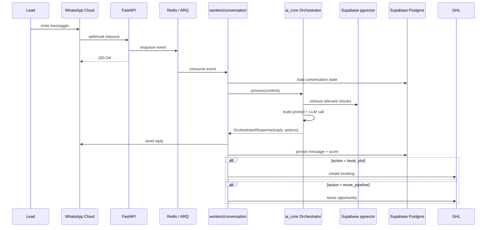
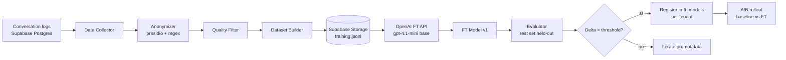
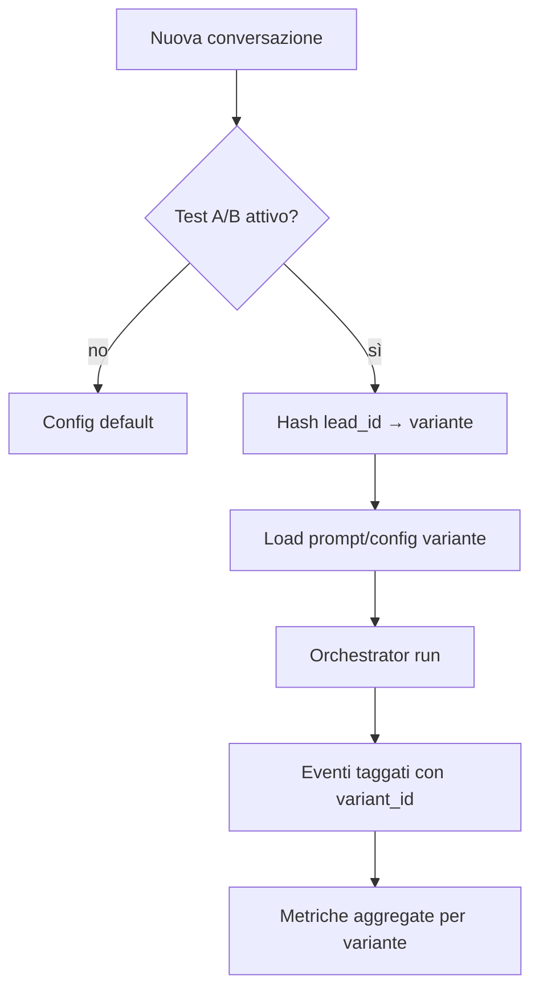

# Reloop AI — Architettura tecnica e componenti di codice

**Documento interno · Versione 1**
Basato sul Capitolato Tecnico (Allegato A) del Contratto di Collaborazione tra BM ECOMMERCE LLC e Wave Solutions SRL del 16/04/2026.

---

## 1. Panoramica

Reloop AI è una piattaforma SaaS **multitenant a due livelli** con agente AI conversazionale che automatizza acquisizione e gestione lead tramite **WhatsApp**, integrata con l'infrastruttura **GoHighLevel (GHL)** del Cliente.

Livelli tenant:

- **Tenant principale** (agenzia/Cliente): pannello admin con visibilità completa sui merchant, dashboard unificata, gestione configurazioni default e template.
- **Sub-tenant** (merchant): pannello dedicato con gestione bot, knowledge base, playground, A/B testing, analytics e report per il proprio business.

La Versione 1 copre **13 casi d'uso** suddivisi in tre aree (Conversazione & Conversione, Piattaforma & Configurazione, Analytics & Reporting), con **fine-tuning** su dati conversazionali reali come differenziatore chiave.

---

## 2. Stack tecnologico

### Architettura generale

Il sistema separa nettamente **frontend** e **backend**, con Supabase come piattaforma integrata per database, auth, storage e realtime. Il frontend colloquia con Supabase direttamente per operazioni standard (letture autenticate, upload file, subscription realtime) e con il backend Python per operazioni con business logic (onboarding, orchestrazione AI, integrazioni).

### Frontend

- **Next.js 15** (App Router, React Server Components) + **TypeScript 5.x**
- **TailwindCSS** + **shadcn/ui** per design system
- **TanStack Query** per data fetching e cache
- **Zustand** per state locale
- **react-hook-form** + **zod** per validazione form
- **Recharts** per visualizzazioni
- **`@supabase/supabase-js`** per auth, letture RLS-protette, storage, realtime
- **`openapi-typescript`** per generare client tipizzato dal backend FastAPI
- **Turborepo** con pnpm workspaces per il monorepo frontend

### Backend

- **Python 3.12**
- **FastAPI** — framework async-native, OpenAPI auto-generato, type hints
- **Pydantic v2** — validazione request/response
- **SQLAlchemy 2.0 + asyncpg** — ORM async
- **Alembic** — migrazioni DB
- **ARQ** — job queue async-native su Redis
- **httpx** — HTTP client async per integrazioni esterne
- **uv** — package manager e workspace (molto più veloce di Poetry)
- **ruff** + **mypy** — linting e type check
- **pytest** + **pytest-asyncio** — testing
- **structlog** — logging strutturato

### Piattaforma dati (Supabase)

Supabase gestisce database, auth, storage e realtime come piattaforma unificata.

- **PostgreSQL** con **Row-Level Security (RLS)** per isolamento tenant
- **Supabase Auth** — signup, login, password reset, OAuth, JWT
- **Supabase Storage** — documenti KB, export analytics, training data
- **Supabase Realtime** — subscription live per dashboard (UC-11, UC-12)
- **pgvector** (estensione Postgres) — vector search per KB, evita una dipendenza esterna

### Altri servizi dati

- **Redis** — cache, rate limiting, queue ARQ (addon Railway)

### AI & ML

Vedi sezione 6.7 per il dettaglio sul model routing. Sintesi:

- **OpenAI SDK** (Python) come provider primario
- **GPT-5-mini** per conversazioni base (default)
- **GPT-5.2** per escalation su obiezioni complesse
- **GPT-4.1-mini** come target del fine-tuning (sett. 9–10)
- **text-embedding-3-small** per embeddings KB
- **Anthropic SDK** (Claude Sonnet 4.6) come fallback opzionale via feature flag

### Integrazioni

- **WhatsApp Cloud API** (Meta) — BSP diretto
- **GoHighLevel** REST API + webhook subscriptions

### Infrastruttura

- **Railway** — hosting unificato: FastAPI API, worker Python, Redis addon. Un unico progetto Railway con più servizi, preview environments per PR da GitHub.
- **Vercel** — hosting frontend Next.js
- **Supabase Cloud** — piattaforma dati gestita (EU region per compliance GDPR)
- **GitHub Actions** — CI/CD: lint, typecheck, test, build, rigenerazione tipi OpenAPI, deploy
- **Sentry** — error tracking (frontend + backend)
- **PostHog** — product analytics
- **Logtail** o **Grafana Cloud** — log aggregation per servizi Railway

---

## 3. Struttura del repository

Il progetto vive in **un unico monorepo** con frontend e backend fianco a fianco. Una sola persona lavora sul codice, quindi la semplicità operativa prevale sulla separazione delle toolchain. I tipi condivisi tra frontend e backend sono generati automaticamente dallo schema OpenAPI di FastAPI.

```
reloop-ai/
├── frontend/                   # Turborepo (pnpm workspaces)
│   ├── apps/
│   │   ├── web-admin/          # Dashboard agenzia (Next.js)
│   │   └── web-merchant/       # Portal merchant (Next.js)
│   ├── packages/
│   │   ├── ui/                 # Component library condivisa
│   │   ├── api-client/         # Client tipizzato (generato da OpenAPI)
│   │   ├── supabase-client/    # Wrapper Supabase SDK + tipi DB
│   │   └── config/             # Config condivise, env, tipi
│   ├── turbo.json
│   ├── pnpm-workspace.yaml
│   └── package.json
├── backend/                    # uv workspace
│   ├── services/
│   │   └── api/                # FastAPI app
│   │       ├── src/api/
│   │       │   ├── routers/    # Endpoints REST
│   │       │   ├── dependencies/  # DI: auth, tenant context, DB session
│   │       │   ├── schemas/    # Pydantic models
│   │       │   └── main.py
│   │       └── pyproject.toml
│   ├── workers/
│   │   ├── conversation/       # Handler messaggi WhatsApp
│   │   ├── scheduler/          # Job schedulati
│   │   └── fine_tuning/        # Pipeline FT
│   ├── libs/
│   │   ├── ai_core/            # Orchestrator, RAG, scoring, classifier
│   │   ├── integrations/       # Client GHL, WhatsApp
│   │   ├── db/                 # SQLAlchemy models, Alembic migrations
│   │   ├── config_resolver/    # Gerarchia di configurazione
│   │   └── shared/             # Utility, logging, errori
│   ├── pyproject.toml          # Root uv workspace
│   └── uv.lock
├── infra/
│   ├── railway/                # Config deploy Railway
│   └── docker/                 # Dockerfile per ogni servizio
├── docs/
│   ├── decisions/              # Architecture Decision Records (ADR)
│   └── runbooks/               # Procedure operative
├── scripts/
│   ├── generate-api-types.sh   # Rigenera packages/api-client da OpenAPI
│   └── setup-local.sh          # Setup ambiente locale (Supabase CLI, env)
├── .github/
│   └── workflows/              # CI/CD unificato con path filters
├── .gitignore
└── README.md
```

### Gestione delle toolchain diverse

Frontend e backend mantengono i propri tooling nativi — `pnpm` + Turborepo per TypeScript, `uv` per Python — ognuno con la propria root. Non c'è bisogno di orchestratori cross-linguaggio tipo Nx o Bazel: il monorepo è logico (un solo repo Git), non build-system-level.

Il CI GitHub Actions usa **path filters** per far partire solo i job pertinenti: modifiche in `frontend/**` triggano lint/test/build frontend, modifiche in `backend/**` triggano quelli backend. Per lo sviluppatore, basta `cd frontend` o `cd backend` ed è nel mondo giusto.

### Contratto OpenAPI frontend ↔ backend

FastAPI genera automaticamente `openapi.json`. Lo script `scripts/generate-api-types.sh`:

1. Fa partire il backend in locale o punta a staging
2. Scarica lo schema OpenAPI
3. Rigenera `frontend/packages/api-client/src/generated.ts` via `openapi-typescript`

Il CI del frontend esegue questo script e fallisce se ci sono modifiche non committate (drift check). In pratica: se cambi la firma di un endpoint FastAPI, il commit non passa finché non hai rigenerato i tipi.

### Consolidamento worker

In produzione Railway, i tre moduli in `backend/workers/` (conversation, scheduler, fine_tuning) girano come **singolo processo ARQ** che ascolta tutte le queue (`wa:inbound`, `scheduler:jobs`, `ft:pipeline`). La separazione resta a livello di codice per organizzazione, ma l'entry point di deploy è unico. Riduce istanze idle e semplifica il deploy.

### Vantaggi di questo setup

- **Un solo `git clone`** e sei in grado di lavorare su tutto
- **Un solo PR** per modifiche che toccano frontend e backend insieme (es. nuovo endpoint + UI che lo consuma)
- **Issue tracking unificato** su un solo repo GitHub
- **ADR condivisi** in `docs/decisions/` che documentano le scelte che attraversano i due mondi
- **Deploy indipendenti comunque possibili**: Vercel punta a `frontend/`, Railway punta a `backend/` come root directory del servizio

---

## 4. Componenti frontend

### 4.1 `apps/web-admin` — Dashboard agenzia

Pannello dell'agenzia (tenant principale).

**Rotte principali**

- `/login`, `/auth/*` — autenticazione admin
- `/merchants` — lista merchant, creazione, sospensione, attivazione
- `/merchants/[id]` — drill-down merchant (config, analytics, conversazioni)
- `/dashboard` — **UC-12** Dashboard Unificata Admin Agenzia
- `/templates` — **UC-10** Bot Default Agenzia (template condivisi)
- `/settings` — configurazioni globali, API keys, webhook
- `/billing` — fatturazione (se applicabile)

**Componenti chiave**

- `MerchantTable` — lista con filtri, ranking e drill-down
- `AggregatedKPICards` — KPI cross-merchant (lead totali, conversion rate, bot attivi)
- `BotTemplateEditor` — editor template default con preview
- `MerchantDetailDrawer` — sidebar con metriche singolo merchant

### 4.2 `apps/web-merchant` — Portal merchant

Pannello del singolo merchant (sub-tenant).

**Rotte principali**

- `/login`, `/auth/*` — autenticazione merchant
- `/dashboard` — **UC-11** Dashboard Analytics Merchant
- `/bot/config` — configurazione bot (prompt, tono, regole)
- `/bot/knowledge-base` — **UC-07** gestione KB
- `/bot/playground` — **UC-08** Playground & Addestramento
- `/bot/ab-testing` — **UC-09** A/B Testing
- `/conversations` — storico conversazioni WhatsApp
- `/reports/objections` — **UC-13** Report Obiezioni
- `/integrations` — stato connessioni GHL/WhatsApp
- `/settings` — dati azienda, team, notifiche

**Componenti chiave**

- `KnowledgeBaseUploader` — drag-drop con parsing e preview chunk
- `BotPlayground` — chat simulator con switch rapido tra versioni bot
- `ABTestSplitConfig` — configurazione split percentuale + metriche per variante
- `MerchantKPIDashboard` — lead ricevute, tasso risposta, booking rate, distribuzione scoring
- `ObjectionHeatmap` — heatmap categorie obiezioni + trend temporali
- `ConversationViewer` — threaded view con sentiment badge e lead score

### 4.3 `packages/ui` — Component library

Componenti condivisi tra admin e merchant, tema coerente su base shadcn/ui:

- Primitive (Button, Input, Select, Dialog, Drawer, Table, Toast)
- Pattern composti (KPICard, MetricTile, FilterBar, DateRangePicker)
- Chart wrapper su Recharts (LineChart, BarChart, FunnelChart, HeatMap)
- Layout (AppShell, Sidebar, PageHeader, AuthGate)

### 4.4 Pattern di accesso: Supabase vs backend Python

Il frontend ha due modalità di accesso ai dati, scelte in base al tipo di operazione:

**Accesso diretto a Supabase** (via `@supabase/supabase-js`)

Per operazioni che possono essere servite direttamente dalla RLS sul DB senza business logic:

- Login, signup, password reset, refresh token — via Supabase Auth
- Letture di liste e dettagli protetti da RLS (es. lista conversazioni, messaggi di un thread, documenti KB propri)
- Upload documenti KB e export analytics — via Supabase Storage
- Subscription realtime per aggiornamenti live dashboard — via Supabase Realtime

**Chiamata al backend Python** (via client OpenAPI generato)

Per operazioni che richiedono business logic, orchestrazione o side-effect:

- Onboarding multi-step (crea merchant, provisiona bot config, seed template)
- Trigger playground AI (richiede chiamata LLM, non è CRUD)
- Setup integrazioni GHL (OAuth flow, validazione, webhook registration)
- Azioni su pipeline lead (richiedono chiamate GHL esterne)
- Generazione report on-demand (richiedono elaborazione)
- Deploy di un nuovo prompt / versione bot
- Avvio manuale di un job FT

Il frontend invia sempre il JWT Supabase nelle Authorization header. Il backend lo verifica via JWKS di Supabase e estrae `tenant_id` e `merchant_id` dai claim custom per il tenant context.

---

## 5. Componenti backend

### 5.1 `services/api` — FastAPI app

API REST consumata dal frontend e dai webhook esterni. FastAPI con router per dominio e dependency injection per cross-cutting concerns.

**Cross-cutting concerns (dependencies FastAPI)**

- `verify_supabase_jwt` — valida JWT Supabase via JWKS, ritorna claims
- `get_tenant_context` — estrae `tenant_id`, `merchant_id`, `role` dai claim custom e li inietta nel request state
- `require_role(*roles)` — RBAC (`agency_admin`, `agency_user`, `merchant_admin`, `merchant_user`)
- `rate_limit(key, limit)` — rate limiting via Redis
- `get_db_session` — sessione SQLAlchemy async con `SET LOCAL` del `tenant_id` per RLS
- Middleware `structlog` per trace_id e request logging
- Exception handler globale per normalizzazione errori

**Router di dominio**

- `routers/auth` — endpoint di supporto (whoami, switch merchant), delega auth principale a Supabase
- `routers/tenants` — CRUD agenzie (admin-only)
- `routers/merchants` — CRUD merchant, onboarding, sospensione
- `routers/users` — gestione utenti e ruoli
- `routers/bot_config` — configurazione bot per merchant
- `routers/knowledge_base` — CRUD documenti KB + trigger indexing
- `routers/conversations` — lettura storico conversazioni (letture semplici via Supabase diretto)
- `routers/analytics` — query aggregate KPI
- `routers/playground` — simulazione bot per testing (UC-08)
- `routers/ab_test` — config e metriche A/B (UC-09)
- `routers/reports` — generazione report obiezioni e insight (UC-13)
- `routers/integrations` — OAuth GHL, setup WhatsApp, management credenziali
- `routers/webhooks` — endpoint pubblici per webhook inbound (GHL, WhatsApp)

### 5.2 `workers/conversation` — Processor messaggi WhatsApp

Worker ARQ che consuma la queue `wa:inbound` e gestisce ogni messaggio in ingresso.

**Flusso logico**

1. Riceve evento WhatsApp (inbound) via queue
2. Risolve tenant/merchant da `phone_number_id`
3. Carica conversation state (Redis + Postgres)
4. Invoca `libs.ai_core` orchestrator per generare risposta
5. Scrive risposta via WhatsApp Cloud API
6. Aggiorna conversation log e trigger side-effects (scoring, pipeline move)

**Casi d'uso coperti:** UC-01, UC-02, UC-03, UC-04, UC-05

### 5.3 `workers/scheduler` — Job schedulati

Worker ARQ per task asincroni e cron.

**Job types**

- `reactivate_dormant_leads` — **UC-06** Riattivazione Database Dormiente
- `followup_no_answer` — follow-up automatici (**UC-03**)
- `daily_kpi_rollup` — aggregazione KPI per dashboard
- `objection_extraction` — estrazione obiezioni post-conversazione (**UC-13**)
- `kb_reindex` — re-indicizzazione KB quando documenti cambiano

### 5.4 `workers/fine_tuning` — Pipeline fine-tuning

Worker dedicato alla fase 9–10 del progetto. Job Python che orchestrano chiamate alle API OpenAI.

**Step**

1. `data_collector` — estrae conversazioni reali dalle ultime 4 settimane
2. `data_anonymizer` — PII redaction (email, telefoni, nomi, indirizzi) con presidio + regex custom
3. `quality_filter` — filtra conversazioni non valide (bot errors, dropoff prematuri)
4. `dataset_builder` — costruisce dataset JSONL conforme al formato OpenAI FT
5. `training_job` — lancia job FT su OpenAI API, poll stato fino a completamento
6. `evaluator` — valuta modello FT vs baseline su test set held-out con metriche custom
7. `deployer` — registra il modello FT con versioning per tenant in tabella `ft_models`

### 5.5 Consolidamento deploy

In produzione Railway, i tre worker girano come **singolo processo ARQ** che ascolta tutte e tre le queue (`wa:inbound`, `scheduler:jobs`, `ft:pipeline`). Le directory `workers/conversation`, `workers/scheduler`, `workers/fine_tuning` restano separate come moduli Python per organizzare il codice, ma vengono registrate come handler nello stesso `WorkerSettings` di ARQ. Riduce istanze idle e semplifica il deploy.

---

## 6. `libs/ai_core` — AI Engine

Libreria Python riutilizzata da API e worker per tutto ciò che riguarda AI.

### 6.1 Orchestrator

Classe `ConversationOrchestrator` — entry point per ogni turno conversazione.

Responsabilità:

- Costruisce context (system prompt + history + KB retrieval + lead data)
- Seleziona modello tramite il `ModelRouter` (vedi 6.7)
- Invoca LLM con structured output (Pydantic schema per `actions`)
- Parse response (intent detection, action extraction)
- Ritorna `OrchestratorResponse(reply_text, actions)` dove `actions` può includere `book_slot`, `move_pipeline`, `update_score`, `escalate_human`

### 6.2 Prompt Manager

Gestione template prompt versionati per tenant.

- Template base (system prompt generico)
- Override per merchant (tono, stile, regole business)
- Variabili dinamiche (`merchant_name`, `business_context`, `kb_snippets`)
- Versioning per A/B testing (**UC-09**)
- Template storage: tabella `prompt_templates` con `version` e `variant_id`

### 6.3 RAG Engine

Retrieval augmented generation sulla knowledge base (**UC-07**).

- `Indexer` — parsing PDF/DOCX/URL (via `unstructured` o `pypdf` + `python-docx`) → chunking (semantic + overlap) → embedding → upsert in Postgres con `pgvector`
- `Retriever` — query embedding → top-K search con filtro `tenant_id` → re-ranking opzionale via cross-encoder
- `ContextInjector` — inserisce snippet rilevanti nel prompt con citazioni

L'uso di `pgvector` invece di un vector DB esterno elimina una dipendenza: i chunk vivono nella stessa Postgres Supabase, l'RLS vale anche per loro.

### 6.4 Lead Scoring

**UC-05** Qualificazione Predittiva.

- Modello rules-based per V1 (scoring euristico su risposte qualificanti, tempi di risposta, sentiment, completezza dati)
- Implementazione: funzione pura Python con regole configurabili via `ConfigResolver`
- Hook estendibile a ML model in V2 (sklearn/XGBoost con features estratte dalla conversazione)
- Output: `LeadScore(score: int, reason_codes: list[str])`

### 6.5 Objection Classifier

**UC-13** — estrazione obiezioni da conversazioni.

- Task LLM su conversazione completa con prompt strutturato e structured output Pydantic
- Taxonomy obiezioni configurabile per merchant (prezzo, tempistiche, fiducia, competitor, …)
- Persistenza in tabella `objections` con collegamento a `conversation_id`
- Eseguito in background dal `worker-scheduler` (job `objection_extraction`)

### 6.6 Sentiment Analyzer

Valutazione sentiment turn-by-turn, usato per note pipeline (**UC-04**) e scoring (**UC-05**). Implementazione via LLM chiamata lightweight (GPT-5-nano) o classificatore locale.

### 6.7 Model routing e LLM Client

Abstraction `LLMClient` (Protocol Python) con implementazioni concrete. Il `ModelRouter` sceglie quale client usare in base a tenant settings, complessità della richiesta, e feature flag.

**Implementazioni**

- `OpenAIClient` — wrapper `openai` SDK, gestisce retry, timeout, streaming
- `AnthropicClient` — wrapper `anthropic` SDK, per fallback o A/B comparison
- `FineTunedOpenAIClient` — alias di `OpenAIClient` con `model_name` dinamico per modelli FT per tenant

**Strategia di routing V1**

| Contesto | Modello | Costo (per MTok) |
|---|---|---|
| First response e conversazione standard (default) | `gpt-5-mini` | $0.25 / $2.00 |
| Sentiment analysis turn-by-turn | `gpt-5-nano` | $0.05 / $0.40 |
| Escalation: obiezioni complesse, contesti lunghi, casi edge | `gpt-5.2` | $1.75 / $14.00 |
| Embeddings KB | `text-embedding-3-small` | $0.02 |
| Fine-tuning target (post sett. 9–10) | `gpt-4.1-mini` fine-tuned | $0.80 training, $0.80 / $3.20 inference |
| Fallback provider (feature flag) | `claude-sonnet-4-6` | $3.00 / $15.00 |

**Trigger di escalation verso GPT-5.2**

- Lunghezza context > soglia (es. >4000 token totali)
- Lead score > `hot_threshold` (merita la qualità migliore)
- Keyword obiezioni critiche nel messaggio lead
- Numero di turni conversazione > soglia (conversazione complessa)

**Post fine-tuning (sett. 10)**

Il modello FT su `gpt-4.1-mini` sostituisce `gpt-5-mini` come default per quel tenant specifico. La configurazione `ft_model_id` è per-tenant: ogni merchant può avere il suo modello FT o usare il default. Rollout graduale via A/B (UC-09) per validare il FT vs baseline su metriche reali prima dello switch completo.

### 6.8 Guardrails e safety

- Filtro output: validazione structured response con Pydantic prima di inviare
- Token budget per conversazione (evita conversazioni runaway)
- Rate limiting per tenant su chiamate LLM (protezione costi)
- Content filter: blocca risposte che contengono PII del lead non autorizzata
- Fallback graceful: se LLM fails, messaggio umano pre-configurato + alert

---

## 7. `libs/integrations` — Layer integrazioni

Client Python async basati su `httpx.AsyncClient` con retry, backoff esponenziale e circuit breaker.

### 7.1 GoHighLevel Connector

`libs/integrations/ghl/`

- `GHLClient` — wrapper REST API con OAuth2 token refresh automatico
- `OpportunityService` — CRUD opportunità + move pipeline (**UC-04**)
- `ContactService` — CRUD contatti, custom fields, tag
- `CalendarService` — disponibilità e booking creation (**UC-02**)
- `PipelineService` — lettura pipeline structure, stages
- `WebhookParser` — parsing e validazione eventi GHL in ingresso

### 7.2 WhatsApp Business API Connector

`libs/integrations/whatsapp/`

- `WhatsAppClient` — wrapper Cloud API Meta (send message, template, media)
- `MessageFormatter` — rich message (buttons, lists, media)
- `WebhookVerifier` — validazione signature Meta con HMAC-SHA256
- `WebhookParser` — parsing inbound message/status
- `TemplateManager` — gestione template approvati Meta

### 7.3 Webhook endpoint

Endpoint pubblici esposti dal router FastAPI `webhooks`:

- `POST /webhooks/ghl/{merchant_id}`
- `POST /webhooks/whatsapp/{phone_number_id}`
- `GET  /webhooks/whatsapp/{phone_number_id}` (verification challenge Meta)

Ogni webhook verifica la firma, risolve il tenant da `merchant_id`/`phone_number_id`, e fa push dell'evento normalizzato sulla queue ARQ appropriata per processing asincrono. La response 200 è sincrona — il processing è tutto async per rispettare i timeout di Meta e GHL.

---

## 8. `libs/db` — Data layer

### 8.1 Supabase Postgres — entità principali

SQLAlchemy 2.0 models async, migrazioni gestite via Alembic. Tutto il DB vive su Supabase (EU region per compliance).

- `tenants` — agenzie (tenant principale)
- `merchants` — sub-tenant, FK a `tenants`
- `users` — estende `auth.users` di Supabase con `role`, `tenant_id`, `merchant_id` come custom claims JWT
- `bot_configs` — config bot per merchant, contiene `overrides` JSONB per la gerarchia di config
- `bot_templates` — template agenzia (**UC-10**), contiene `defaults` JSONB
- `prompt_templates` — prompt versionati con `variant_id` per A/B testing
- `knowledge_base_docs` — metadata documenti KB (i file binari vivono in Supabase Storage)
- `kb_chunks` — chunk con embedding `vector(1536)` via `pgvector`
- `conversations` — metadata thread WhatsApp
- `messages` — singoli turni (ruolo, contenuto, timestamp, variant_id)
- `leads` — contatti arricchiti con score, sentiment, stato
- `objections` — obiezioni rilevate, categoria, `conversation_id`
- `ab_experiments` — definizione test A/B
- `ab_assignments` — assegnazione lead a variante (hash deterministico)
- `analytics_events` — eventi per rollup KPI
- `integrations` — credenziali GHL/WhatsApp cifrate per merchant (AES-256-GCM, KEK via env)
- `ft_models` — modelli fine-tuned per tenant, con versioning e metriche di evaluation

**Multitenancy:** Row-Level Security (RLS) Postgres su tutte le tabelle, con policy basate su `auth.jwt() ->> 'tenant_id'` e `auth.jwt() ->> 'merchant_id'`. Le policy leggono direttamente dai claim JWT Supabase, quindi valgono sia per accessi diretti dal frontend sia per accessi dal backend (che usa lo stesso JWT).

Il backend, per operazioni amministrative che devono bypassare RLS (es. creazione merchant da parte dell'agenzia), usa il **service role key** di Supabase in modo esplicito e tracciato nei log.

### 8.2 `pgvector` — vector search

Estensione Postgres nativa su Supabase, nessun servizio separato:

- Colonna `embedding vector(1536)` su `kb_chunks`
- Index HNSW per similarity search (`vector_cosine_ops`)
- Query con filtro `tenant_id` per isolamento (la RLS lo garantisce a livello di riga)
- Top-K retrieval via `ORDER BY embedding <=> query_embedding LIMIT k`

Il vantaggio rispetto a Qdrant/Pinecone: una dipendenza in meno, stessa Postgres, stessa RLS, stesso backup, stessa compliance.

### 8.3 Redis — cache & queue

Addon Railway:

- Cache config risolta (TTL 60s, invalidata on write)
- Rate limiting counters
- Sessioni bot per conversation state (hot path)
- Queue ARQ: `wa:inbound`, `ghl:events`, `scheduler:jobs`, `ft:pipeline`
- Deduplication keys per idempotenza webhook

### 8.4 Supabase Storage

Bucket dedicati con policy di accesso basate su tenant:

- `kb-documents` — documenti KB originali (PDF, DOCX)
- `ft-training-data` — dataset JSONL per fine-tuning (accesso solo service role)
- `analytics-exports` — export CSV on-demand (signed URL temporanei)
- `branding-assets` — eventuali logo/asset merchant

Policy: ogni bucket ha RLS via `auth.jwt() ->> 'merchant_id'` per isolare i file per merchant.

### 8.5 Realtime

Supabase Realtime abilitato su tabelle specifiche per dashboard live:

- `analytics_events` — update KPI in tempo reale su dashboard merchant (**UC-11**) e agenzia (**UC-12**)
- `conversations` — notifiche nuove conversazioni attive
- `ft_models` — stato avanzamento job fine-tuning

Il frontend si subscribe direttamente via `supabase-js`, senza passare dal backend. La RLS garantisce isolamento: ogni client riceve solo gli eventi del proprio tenant.

---

## 9. Gerarchia di configurazione

Tutti i parametri operativi del bot seguono una cascade a tre livelli: **merchant → agenzia → system**. Ogni livello può fare override del successivo; se un parametro non è settato a un livello, si scende a quello sotto. Il merchant ha sempre l'ultima parola tramite il proprio pannello; se non tocca nulla, i default dell'agenzia sono attivi; se nemmeno l'agenzia ha impostato nulla, vale il system default hardcoded.

Il pattern è "convention over configuration": il sistema funziona out-of-the-box con valori ragionevoli e l'utente configura solo ciò che vuole davvero personalizzare.

### 9.1 Livelli

1. **System defaults** — hardcoded in `packages/config/defaults.ts`, fallback di ultima istanza, mai null. Aggiornabili solo con deploy.
2. **Agency defaults** — override globali a livello agenzia (**UC-10**), configurati dal pannello admin in `/templates`, memorizzati in `bot_templates.defaults` (JSONB).
3. **Merchant overrides** — override del singolo merchant dal portal, memorizzati in `bot_configs.overrides` (JSONB).

### 9.2 Resolution a runtime

Ogni lookup passa attraverso un `ConfigResolver` in `libs/config_resolver`:

```python
async def resolve(param_key: str, merchant_id: UUID) -> Any:
    if (v := await merchant_override(merchant_id, param_key)) is not None:
        return v
    tenant_id = await tenant_of(merchant_id)
    if (v := await agency_default(tenant_id, param_key)) is not None:
        return v
    return system_default(param_key)
```

Caching via Redis con invalidazione on write al livello corrispondente. TTL breve (~60s) come safety net contro cache stale.

### 9.3 Schema DB

Per la V1 raccomando **JSONB su tabelle esistenti** — atomico, semplice, volume dei parametri limitato:

- `bot_templates.defaults` JSONB — override agenzia
- `bot_configs.overrides` JSONB — override merchant

Chiavi tipizzate via Pydantic schema in `libs/config_resolver/schema.py`. Lo stesso schema viene esportato per il frontend tramite l'OpenAPI generato, così entrambi i lati validano gli stessi campi.

Alternativa più granulare (se servirà audit log o diff parametro-per-parametro in V2): tabella dedicata `config_values` con `(scope, entity_id, param_key, value_json, updated_at, updated_by)` e unique constraint su `(scope, entity_id, param_key)`.

### 9.4 Parametri configurabili

Tabella completa dei parametri esposti via pannello, con system default proposto. Ogni parametro è configurabile sia a livello agenzia sia a livello merchant salvo `locked_by_agency = true`.

| Parametro | Key | UC | System default | Range |
|---|---|---|---|---|
| Primo reminder "senza risposta" | `no_answer.first_reminder_min` | UC-03 | 120 min | 30–480 |
| Secondo reminder | `no_answer.second_reminder_min` | UC-03 | 1440 min | 720–2880 |
| Numero max follow-up | `no_answer.max_followups` | UC-03 | 2 | 1–4 |
| Soglia giorni "dormiente" | `reactivation.dormant_days` | UC-06 | 90 giorni | 30–180 |
| Cadenza riattivazione | `reactivation.interval_days` | UC-06 | 7 giorni | 3–30 |
| Max tentativi riattivazione | `reactivation.max_attempts` | UC-06 | 3 | 1–5 |
| Soglia score per advance pipeline | `pipeline.advance_threshold` | UC-04 | 60 | 0–100 |
| Stage target pipeline qualificata | `pipeline.qualified_stage_id` | UC-04 | (ref GHL) | — |
| Soglia lead "hot" | `scoring.hot_threshold` | UC-05 | 80 | 50–100 |
| Soglia lead "cold" | `scoring.cold_threshold` | UC-05 | 30 | 0–50 |
| Split A/B default | `ab_test.default_split` | UC-09 | 50/50 | 10/90–90/10 |
| Sample size minimo A/B | `ab_test.min_sample` | UC-09 | 100 | 50–1000 |
| Orari operativi bot | `schedule.active_hours` | globale | 24/7 | custom cron |
| Messaggio fuori orario | `schedule.off_hours_message` | globale | disclaimer default | testo libero |
| Timezone merchant | `schedule.timezone` | globale | Europe/Rome | IANA TZ |
| Top-K RAG retrieval | `rag.top_k` | UC-07 | 5 | 3–10 |
| Soglia similarity RAG | `rag.min_score` | UC-07 | 0.7 | 0.5–0.9 |
| Lingua primaria bot | `bot.language` | globale | it | ISO 639-1 |
| Tono del bot | `bot.tone` | globale | "professionale-amichevole" | enum |
| Escalation a umano | `escalation.enabled` | globale | true | bool |
| Retention messaggi (GDPR) | `privacy.retention_months` | globale | 24 | 6–60 |

### 9.5 Pattern UI

Nel pannello merchant ogni parametro mostra tre stati visivi per rendere trasparente da dove viene il valore corrente:

- **Inherited** — etichetta grigia: "Usando default agenzia: X" oppure "Usando system default: X"
- **Customized** — valore in evidenza + link "Ripristina default"
- **Locked by agency** — alcuni parametri (es. retention GDPR, escalation) possono essere bloccati dall'agenzia e visualizzati read-only nel pannello merchant

Questo pattern fa capire all'utente quanto sta deviando dai default e gli permette di tornare indietro con un click. Lato agenzia, un toggle `locked_by_agency` per ogni parametro permette di imporre valori che i merchant non possono modificare (utile per compliance e policy).

---

## 10. Mappa use case → componenti

| UC | Nome | Frontend | Backend | AI Core | Integrazioni | Data |
|---|---|---|---|---|---|---|
| UC-01 | First Response | — | workers/conversation | Orchestrator, Prompt Manager | WhatsApp | conversations, messages |
| UC-02 | Booking Autonomo | — | workers/conversation | Orchestrator (action: book_slot) | WhatsApp, GHL Calendar | conversations, leads |
| UC-03 | Senza Risposta | — | workers/scheduler | Orchestrator | WhatsApp, GHL | conversations |
| UC-04 | Pipeline Auto | — | workers/conversation | Orchestrator, Sentiment | GHL Opportunity | leads |
| UC-05 | Lead Scoring | merchant: dashboard (Supabase realtime) | workers/conversation | Lead Scoring | — | leads |
| UC-06 | Riattivazione Dormienti | merchant: config | workers/scheduler | Orchestrator | WhatsApp, GHL | leads, conversations |
| UC-07 | Knowledge Base | merchant: /bot/knowledge-base (Supabase Storage upload) | routers/knowledge_base | RAG Indexer | — | kb_docs, kb_chunks (pgvector) |
| UC-08 | Playground | merchant: /bot/playground | routers/playground | Orchestrator (sandbox) | — | bot_configs |
| UC-09 | A/B Testing | merchant: /bot/ab-testing | routers/ab_test | Prompt Manager | — | ab_experiments, ab_assignments |
| UC-10 | Bot Default Agenzia | admin: /templates | routers/bot_config | — | — | bot_templates |
| UC-11 | Dashboard Merchant | merchant: /dashboard (Supabase realtime) | routers/analytics | — | — | analytics_events |
| UC-12 | Dashboard Admin | admin: /dashboard (Supabase realtime) | routers/analytics | — | — | analytics_events |
| UC-13 | Report Obiezioni | merchant: /reports/objections | routers/reports, workers/scheduler | Objection Classifier | — | objections |

---

## 11. Flussi chiave

### 11.1 Flusso conversazione (UC-01 / 02 / 04 / 05)



### 11.2 Flusso fine-tuning (settimane 9–10)



### 11.3 Flusso A/B testing (UC-09)



---

## 12. Sicurezza e multitenancy

- **Isolamento dati** — RLS Postgres su tutte le tabelle, policy basate su `auth.jwt() ->> 'tenant_id'` e `merchant_id`. Vale sia per accessi diretti dal frontend (Supabase client) sia per accessi dal backend (FastAPI con JWT Supabase).
- **Autenticazione** — Supabase Auth gestisce signup/login/password reset/OAuth. JWT include custom claims `tenant_id`, `merchant_id`, `role`. Il backend verifica il JWT via JWKS Supabase e costruisce il tenant context tramite FastAPI dependency.
- **Service role** — per operazioni admin che devono bypassare RLS (creazione merchant, amministrazione), il backend usa il service role key Supabase in modo esplicito, loggato con `actor_id` per audit.
- **Credenziali esterne** — API key GHL/WA cifrate con AES-256-GCM, KEK gestita via variabili env Railway + Supabase Vault per le chiavi più sensibili.
- **GDPR** — dati conversazione di proprietà del Cliente (Art. 5.2 contratto); retention policy configurabile; export e right-to-erasure API. Region Supabase in EU per rispettare data residency.
- **PII in fine-tuning** — anonimizzazione pre-training obbligatoria con `presidio-analyzer` + regex custom (Art. 5.2: accesso dati esclusivamente per fine-tuning).
- **Rate limiting** — per endpoint pubblici e per tenant su quota LLM, implementato via Redis con sliding window.
- **Webhook signature** — validazione HMAC-SHA256 per WhatsApp, OAuth2 + signature per GHL. Eventi non firmati scartati prima dell'enqueue.

---

## 13. Infrastruttura e deploy

### 13.1 Topologia

- **Vercel** — hosting frontend (Next.js), deploy preview automatici per ogni PR, edge network globale
- **Railway** — hosting backend unificato, un progetto con più servizi:
  - `api` — FastAPI (uvicorn con workers gunicorn)
  - `worker` — processo ARQ consolidato che consuma tutte le queue
  - `redis` — addon Redis managed
- **Supabase Cloud** — Postgres + Auth + Storage + Realtime + pgvector, region EU (Frankfurt)

### 13.2 Setup Railway

Ogni servizio Railway punta al monorepo unico con **Root Directory** configurata su `backend/` e path al servizio specifico:

```
api:     root = backend/,  start = uvicorn services.api.main:app --host 0.0.0.0 --port $PORT
worker:  root = backend/,  start = arq services.worker.settings.WorkerSettings
```

Configurazione Railway chiave:

- **Environments**: `production` + `staging`, entrambi auto-deploy da branch (`main` → prod, `develop` → staging)
- **Preview environments** per PR per validare modifiche prima del merge
- **Healthcheck** su `GET /health` per FastAPI — Railway restart automatico su failure
- **Shared env vars** tra servizi dello stesso environment (Supabase URL, keys, OpenAI API key, Redis URL auto-iniettato)
- **Cron** nativo Railway per `daily_kpi_rollup` e job ricorrenti (alternativa ad ARQ cron)
- **Watch paths**: Railway deploya solo quando cambia qualcosa in `backend/**`, ignorando modifiche a `frontend/` o `docs/`

### 13.3 CI/CD (GitHub Actions)

Un singolo workflow nel repo con **path filters** che decidono quali job eseguire.

**Job frontend** (trigger: modifiche in `frontend/**`)
- Lint (eslint) + typecheck (tsc)
- Rigenerazione tipi OpenAPI da schema backend + **diff check** (fallisce se non committato)
- Test (vitest) + build
- Deploy Vercel automatico (con Root Directory = `frontend/apps/web-admin` e `frontend/apps/web-merchant`)

**Job backend** (trigger: modifiche in `backend/**`)
- Lint (ruff) + format check (ruff format)
- Type check (mypy)
- Test (pytest + pytest-asyncio)
- Migrazione DB su preview env (Alembic)
- Export OpenAPI schema come artifact per consumo del job frontend
- Deploy Railway automatico

**Job documentazione** (trigger: modifiche in `docs/**`)
- Link check, spellcheck (opzionale)
- No deploy

### 13.4 Environments

| Env | Frontend | Backend | Supabase |
|---|---|---|---|
| local | `pnpm dev` | `uvicorn --reload` + `arq --watch` | Supabase CLI local (`supabase start`) |
| staging | Vercel preview | Railway staging | progetto Supabase staging |
| production | Vercel prod | Railway production | progetto Supabase production (EU) |

Feature flag via env vars + tabella `feature_flags` in DB per toggling a caldo senza redeploy.

### 13.5 Observability

- **Sentry** — error tracking con source map (frontend) e release tagging (backend), alert su error rate e regression
- **PostHog** — product analytics, session replay, funnel lead (onboarding merchant, prima conversazione, primo booking)
- **Logtail** o **Grafana Cloud** — aggregazione log strutturati `structlog` da Railway, query con trace_id
- **Railway metrics** — CPU/memory/network per servizio nativo
- **Healthcheck dashboard** custom — stato integrazioni GHL/WhatsApp per tenant
- **Alerting** — PagerDuty o Slack webhook su: error spike, LLM outage, queue backlog > soglia

### 13.6 Backup e disaster recovery

- **Supabase Postgres** — PITR nativo (retention 7gg su Pro plan, 30gg su Team plan), backup daily
- **Supabase Storage** — versioning abilitato per bucket KB e training data
- **Redis** — RDB snapshot daily (è cache non-critical, ricostruibile)
- **DR drill** — procedura di restore testata trimestralmente
- **RTO/RPO targets** — RTO 4h, RPO 1h per la V1 (da rivedere in base a SLA commerciali)

---

## 14. Roadmap sviluppo per fase

### Fase 1 — Scheletro (settimane 1–6, milestone M1+M2+M3)

Infrastruttura:

- Setup monorepo unico (Turborepo per `frontend/`, uv workspace per `backend/`)
- Progetto Supabase (staging + production) con schema base e migrazioni Alembic
- Progetto Railway con servizi `api` + `worker` + Redis addon
- CI/CD pipeline GitHub Actions su entrambi i repo
- Auth multitenant via Supabase Auth + custom claims JWT
- Frontend shell (admin + merchant) con auth e layout
- FastAPI skeleton con dependency injection tenant context

Funzionale:

- Integrazione GHL base (contacts, opportunities, calendar) — `libs/integrations/ghl`
- Bot config CRUD + gerarchia config a tre livelli
- Knowledge Base CRUD + indexing su `pgvector`
- Playground sandbox
- A/B Testing framework
- Bot Default templates (UC-10)
- Dashboard mockup con dati demo + Realtime stub

### Fase 2 — WhatsApp live e raccolta dati (settimane 7–8, milestone M4)

- WhatsApp Cloud API integration + verifica numero Meta
- `workers/conversation` in produzione su Railway
- Orchestrator + RAG end-to-end su lead reali
- Dashboard analytics con dati reali e subscription Realtime (UC-11, UC-12)
- Report Obiezioni (UC-13) con classifier attivo
- Deploy produzione completo
- Onboarding Cliente e setup credenziali GHL/WhatsApp
- Avvio data collection per il fine-tuning

### Fase 3 — Fine-tuning e rilascio (settimane 9–10, milestone M5)

- Pipeline fine-tuning end-to-end in `workers/fine_tuning`
- Anonimizzazione dati con presidio + regex custom
- Training job primo modello per il Cliente su `gpt-4.1-mini`
- Evaluation framework (baseline `gpt-5-mini` vs FT)
- Deploy modello FT registrato in `ft_models` con versioning per tenant
- Test comparativi A/B baseline vs FT via UC-09
- Rilascio finale e avvio dei 30 giorni di supporto

---

## 15. Rischi tecnici e mitigazioni

| Rischio | Impatto | Mitigazione |
|---|---|---|
| Volume lead insufficiente sett. 7–10 | Fine-tuning scarso | Art. A.7 contratto: obbligo Cliente volume minimo; fallback su prompt engineering avanzato |
| Approval WhatsApp Business lento | Ritardo go-live | Avvio iter approvazione in Fase 1, non in Fase 2 |
| Rate limit API GHL | Errori sporadici | Retry con backoff esponenziale, queue ARQ bufferizzata, quota monitoring |
| Outage OpenAI | Bot down | Fallback provider Claude Sonnet 4.6 via feature flag + circuit breaker sul `ModelRouter` |
| PII leak in FT dataset | Non conformità GDPR | Doppio layer anonimizzazione (presidio + regex) + review manuale pre-training |
| Costi infrastruttura superiori al previsto | Margine ridotto | Art. 5.3 contratto: infra a carico Cliente, Fornitore solo sviluppo |
| Dati conversazionali di bassa qualità | FT non migliorativo | Quality filter pre-training + evaluation con threshold obbligatorio per deploy |
| Drift contratto OpenAPI frontend↔backend | Bug runtime tra i due lati | CI check che rigenera tipi TS dall'OpenAPI backend a ogni PR, con diff fallito se manca allineamento |
| Lock-in Supabase Auth | Migrazione futura complessa | Astrazione auth lato client in `packages/supabase-client`, migrabile a Clerk/Auth0 senza toccare la business logic frontend |
| Cold start Railway worker | Primo messaggio WA con latenza alta | Mantenere worker sempre up (no scale-to-zero in prod), health check con warm-up Redis connection |
| Bug in policy RLS Supabase | Data leak cross-tenant | Test automatici di isolation in CI (fixture con 2 tenant, assert che le query non vedano dati altrui) |
| Upgrade breaking di `pgvector` | Reindex completo KB | Pin versione estensione, staging test prima di ogni upgrade Supabase |
| Consolidamento worker = single point of failure | Tutto il processing async bloccato se crash | Monitor Sentry + restart automatico Railway, alert su queue backlog, possibilità di split in worker separati se necessario |

---

_Fine documento._
